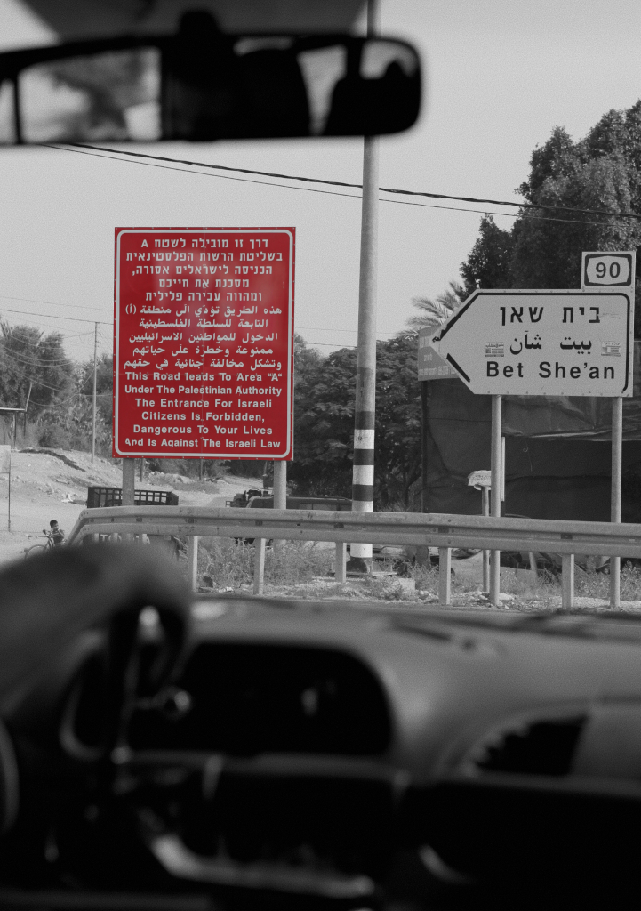

# 2.	Methods and Ethics in the Study of Slow Erasure

This chapter explores the methodological framework underpinning this research, focusing on ethnography as a means to investigate my assertion of the systematic erasure of Palestinian agency, episteme, and identity under Israeli settler-colonialism, which I call slow erasure. My research seeks to critically examine the mechanisms through which such processes may operate, and the ways in which they are experienced, narrated, and resisted by Palestinians themselves. Ethnography, with its focus on deep, contextually informed engagement, has the unique capacity to capture the intricacies of human experiences. By employing a combination of participant observation, interviews, and, additionally, the analysis of secondary data, this research foregrounds the voices of those living under occupation while critically examining the systems of power shaping their realities.

The chapter also situates the study within broader debates on critical social science and feminist methodologies, highlighting their potential to decolonise knowledge production and disrupt hegemonic narratives [see, for instance @lewis2003; @barnes2018; @wibben2018]. In the context of Palestine and the Zionist settler-colonial project, such approaches are particularly vital given the dominance of narratives that frame Israel as the only democracy in the Middle East and often marginalise or erase Palestinian identity, agency, and episteme. Scholarship on this region has long been shaped by Orientalist assumptions and settler-colonial logics, which obscure the structural conditions of occupation and dispossession. While recovering subjugated knowledges remains an important element of anti-colonial scholarship, decolonising is not limited to epistemic reclamation. Decolonial thinkers emphasise that decolonisation is a material, embodied, and place-based project that concerns land, labour, governance, and the redistribution of power [@tuckyand2012; @simpson2014]. Decolonising knowledge production therefore requires more than amplifying marginalised voices; it also demands attention to the practices of living, resisting, and sustaining Indigenous presence within structures that seek elimination. My focus in this thesis is not to claim the capacity to materially repatriate land, but to examine how Palestinians enact forms of decoloniality of living [@griffiths2025] in the everyday, in intimate relations, and in the imaginative and epistemic practices that persist despite, and in defiance of, settler-colonial violence.  Decolonising knowledge production, therefore, is not only a scholarly intervention but an ethical imperative to recover subjugated knowledges and foreground Indigenous resistance. By integrating context-informed and counter-hegemonic approaches this research aims to interrogate the interplay between episteme, power, and resistance in the Palestinian context by integrating context-informed and counter-hegemonic approaches.

The discussion begins with an exploration of ethnography as a methodology and its alignment with the aims of this study. It then addresses the specific methods employed, considerations of ethical integrity, and my positionality, situating the work within both personal and political dimensions. 

---

## References
