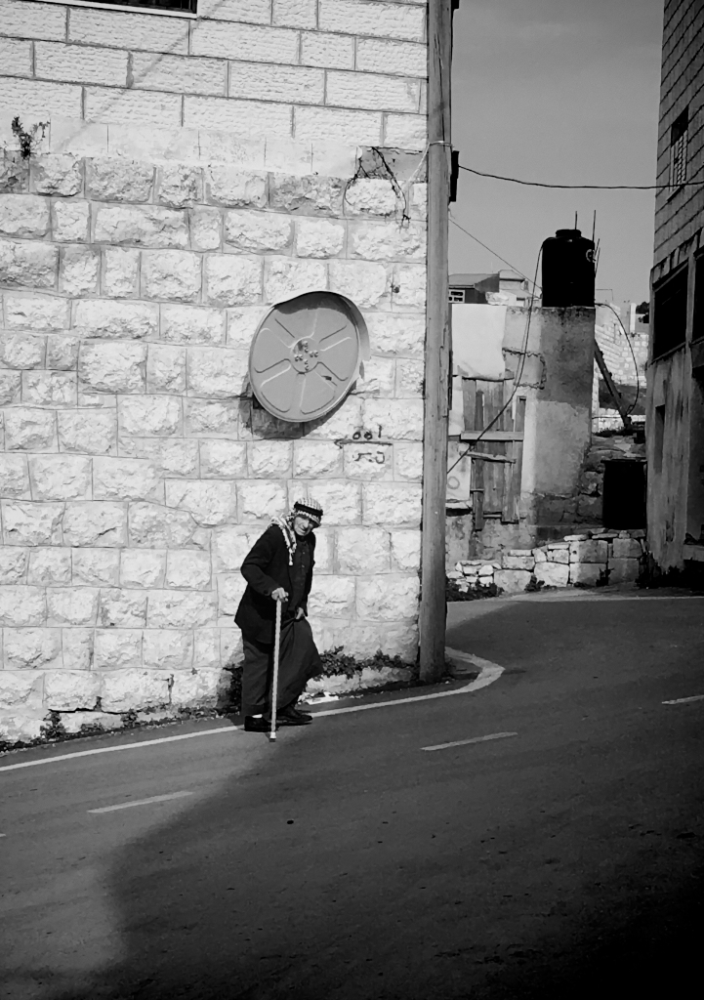

# 3. “From the River to the Sea” من النهر إلى البحر

> “…we stand at the threshold of a history marked by multivocality, contested meanings, paradigmatic controversies, and new textual forms. At some distance down this conjectural path, when its history is written, we will find this has been the era of emancipation: emancipation from what Hannah Arendt calls ‘the coerciveness of Truth’, emancipation from hearing only the voices of Western Europe, emancipation from generations of silence, and emancipation from seeing the world in one color.” [@guba2000, 185]

In order to comprehend the violence experienced by Indigenous communities living under settler-colonial militarisation, I find it crucial to delve into the relevant history. The history of Palestine has been extensively documented in numerous books, with its existence documented in ancient Egyptian and Assyrian texts [@masalha2018]. This chapter focuses on the historical aspects that are directly relevant to the present context and this research orientation, beginning with the establishment of the initial Zionist settlements in Palestine. This chapter also highlights the evolution of Palestinian national identity: it serves as the empirical background for the thesis, offering a broad overview of the struggles faced by Palestinians before delving into the core themes of settler-colonial body politics, biopower, necropolitics, militarisation, and slow erasure in subsequent chapters.

I start the first part of this chapter with an overview of the fundamental distinctions between colonial and settler-colonial projects, as this framework is essential for comprehending the recent history and the challenges faced by Palestinians over the past century and a half. Then, I examine a significant period of history leading up to the Nakba, which resulted in the devastating disruption of Palestinian society. 

The late 1800s witnessed the rise of Zionism and the initial influx of colonial settlers into Palestine (Sharrif 1995). The conclusion of World War I and the establishment of the British Mandate set the stage for the settler-colonial project to commence the cleansing of Palestine by expelling its Indigenous population.[^indigenous] 

The second part of this chapter explores the period between the Nakba and the signing of the Oslo agreements. It encompasses significant events such as the 1967 conquering of the West Bank and East Jerusalem, the first intifada, and the emergence of a political iteration of the Palestine Liberation Organisation (PLO) in Palestine. It also touches upon the Oslo agreements and their implications for the Palestinian people. In this section I also examine how Israel tightened its control over the West Bank and East Jerusalem after the Oslo accords, with those accords simultaneously giving rise to the Palestinian Security Forces and a Security Cooperation plan between Israel and the Palestinian Authority (PA).

In the third section I focus on the post-Oslo period, characterised by the outbreak of the second intifada and the electoral victory of Hamas in the 2006 Palestinian legislative election. I delve into the political divisions that arose within Palestine as a result of Hamas’ victory, as well as the escalation of militarisation and violence on both sides. Furthermore, I highlight the expansion of settler colonisation and the implementation of apartheid measures. 

---

## References

[^indigenous]:  Here, I read indigeneity as “articulated”. This acknowledges the diversity of cultures and histories that currently assert their identity under this banner (Clifford 20001). This means that indigeneity is not fixed but dynamic. Hence, I agree with Pappé, who asserts that “the political nature of the Palestinian struggle can be enriched by incorporating the concept of cultural Indigenous resistance into it, in particular at a time when there is no space or scope for the notion of armed struggle.” (Pappé 2021, 278). It is necessary to emphasise the importance of clearly distinguishing between the terms “Indigenous” and “native,” which are often used interchangeably by activists. Here, “native” is described as a more neutral and static term, almost an ecological statement, that defines a group's geographical location and attachment. In contrast, “Indigenous” represents an evolving position of empowerment and resilience against the oppression that natives face. It serves as the political framework through which communities articulate their national, or group, identity. In this context, the Palestinians in Israel are considered Indigenous, native, and a national minority. (Pappé 2021, 280).

