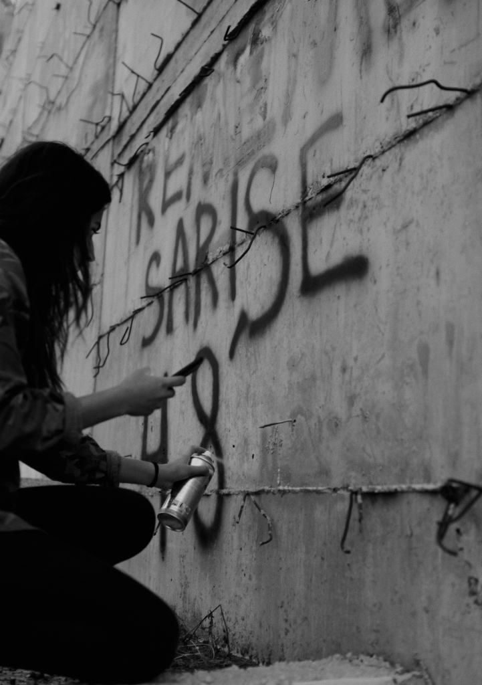

# 4. Towards a Conceptualisation of Slow Erasure

This chapter introduces the key theoretical concepts and frameworks that underpin the analytical chapters of this thesis. My aim is to lay the conceptual groundwork for understanding the settler-colonial dynamics of the Israeli occupation of Palestine, particularly as they relate to identity, agency, and epistemic violence. I bring together critical theories of genocide, biopolitics, necropolitics, body politics, and resistance to demonstrate how the concept of slow erasure can illuminate the long-term, cumulative mechanisms of settler-colonial violence. By engaging thinkers such as Raphael Lemkin, Michel Foucault, Achille Mbembe, Giorgio Agamben, Judith Butler, and Sarah Ahmed, alongside scholars working specifically on Palestine, I develop an analytical lens that allows for a deeper understanding of how power operates not only through overt violence but through structural and symbolic practices that undermine Indigenous existence. These theoretical insights will serve as the foundation for the empirical analyses that follow in Chapters Five through Eight.

I position genocide as a foundational lens for understanding not only the forced displacement, but also the protracted, evolving nature of settler-colonial violence. Building on Raphael Lemkin’s critique of cultural genocide and subsequent attempts by Western nations to limit the Genocide Convention’s scope, I show how settler-colonial states employ slow-moving processes—dispossession, denial of movement, imprisonment among others—to erode Indigenous identities. [@wakeham2022] highlights how these practices, though not always overtly violent, are woven into the long-term logic of settler-colonial invasion. From this vantage point, slow erasure encompasses the myriad techniques that settler powers use to target Indigenous identity, episteme, and forms of agency. Palestinian identity, with its rootedness in land, culture, history, and episteme are a threat to settler legitimacy. By controlling movement, demeaning local knowledge, and suppressing acts of resistance, the settler state attempts to dismantle Indigenous presence. Yet as [@alfred2005] suggest, identity remains dynamic and contested, shaped by ongoing struggles against colonial forces.

Next, I explore Michel Foucault’s notions of biopolitics and power to illuminate the mechanisms of control and identity erasure under the Israeli occupation of Palestine. By considering the interplay between sovereign, disciplinary, and biopolitical modes of power, this analysis reveals how Palestinian identity and episteme can be systematically undermined. [@gordon2008], inspired by Foucault, highlights both the role of state institutions and broader social practices, such as surveillance, legal frameworks, and military interventions, that reinforce these modes of power.

My discussion then turns to how life and death are regulated as a means of reshaping and silencing identities. Building on Foucault’s observation that modern governance extends beyond the traditional right to kill, theorists such as Giorgio Agamben and Achille Mbembe argue that biopolitical power is entangled with sovereign violence, culminating in what Mbembe describes as necropolitics. [@bargu2019] adds another critical layer by showing how violence can become an ordinary mechanism that regulates society, persisting outside the law even in governmentalised states. Her perspective widens the debate, revealing that necropolitical violence need not be exceptional to affect how populations are governed.

I continue with examining how sovereign powers extend their reach beyond controlling life and death to shape the aftermath of death through the concept of grievability. Drawing on Judith Butler’s notion of precarity, we see that not every life is deemed equally worthy of mourning, especially when dehumanisation strips individuals of identity and community. Lives regarded as ungrievable are perceived as forfeited and therefore dispensable, often rationalised as a necessary loss to protect “the living.” In settler-colonial contexts such as Palestine, [@andresfabianhenaocastro2019] observes that this disruption of grief underscores how controlling who is mourned, and how, serves as a powerful mechanism of erasure. Recognising how the denial of mourning is bound up with the denial of humanity highlights the profound impact of sovereign power on both the living and the dead, laying the groundwork for the analytical chapters that follow.

Expanding the concept of necropolitics requires recognising that political violence involves not only killing but also torturing, maiming, and inflicting structural harm on bodies as ways to counter or deter resistance. Torture exemplifies this dynamic: it degrades the individual, sends a warning to broader communities, and often leaves severe psychological scars such as Post Traumatic Stress Disorder (PTSD) and dissociation. When situated in settler-colonial contexts, such violence targets both individuals and entire populations, undermining collective bonds and intensifying trauma. Feminist scholars argue that emotions and bodily vulnerabilities are intertwined, circulating relationally and carrying past violence into the present. Here, I draw on [@ahmed2014]’s perspective that emotions do not simply originate within an individual but emerge in encounters with others, reshaping how people experience pain, memory, and identity. By viewing these practices, torture, the “right to maim,” and the manipulation of emotional ties as part of a broader necropolitical arsenal, we see how power, violence, and social relations converge to shape and, at times, subjugate both individual and communal life.

In a final section I explore how, throughout history, vulnerability has functioned not only as a source of suffering in contexts of political violence but also as a catalyst for resistance, compelling individuals and communities to mobilise around their precarious conditions. Philosophical work by Judith Butler underscores that vulnerability is shaped by social norms, power structures, and material dependencies, thereby positioning the body as a relational entity open to external forces and harm.

---

## References