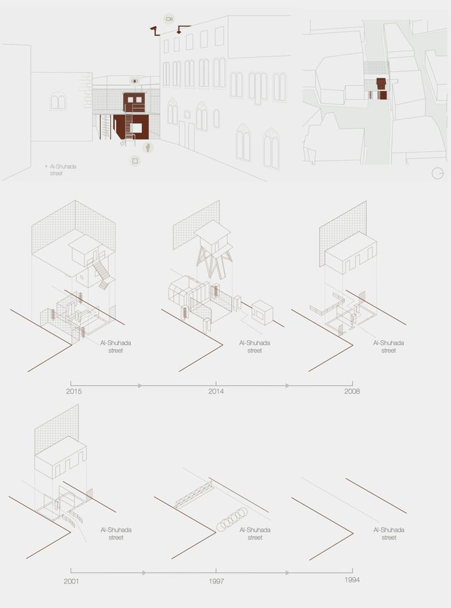
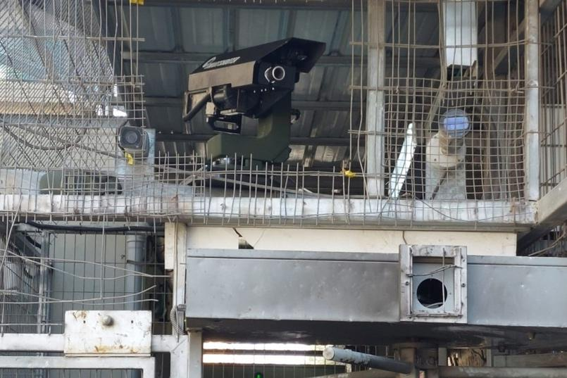
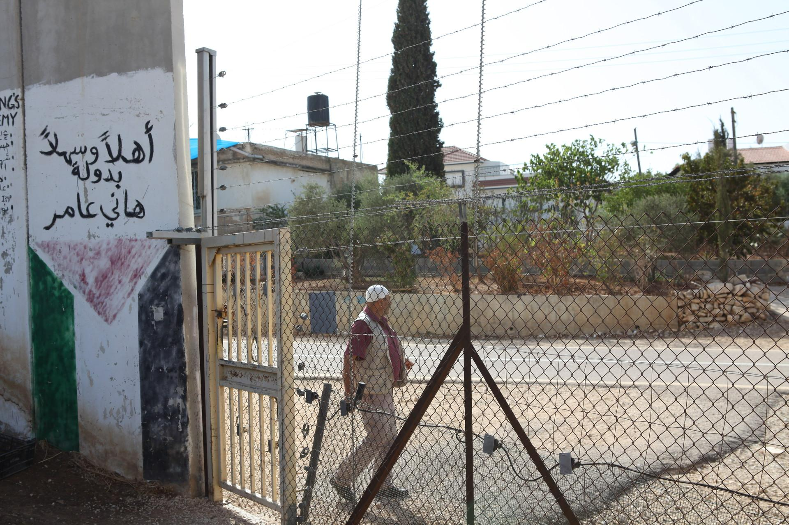
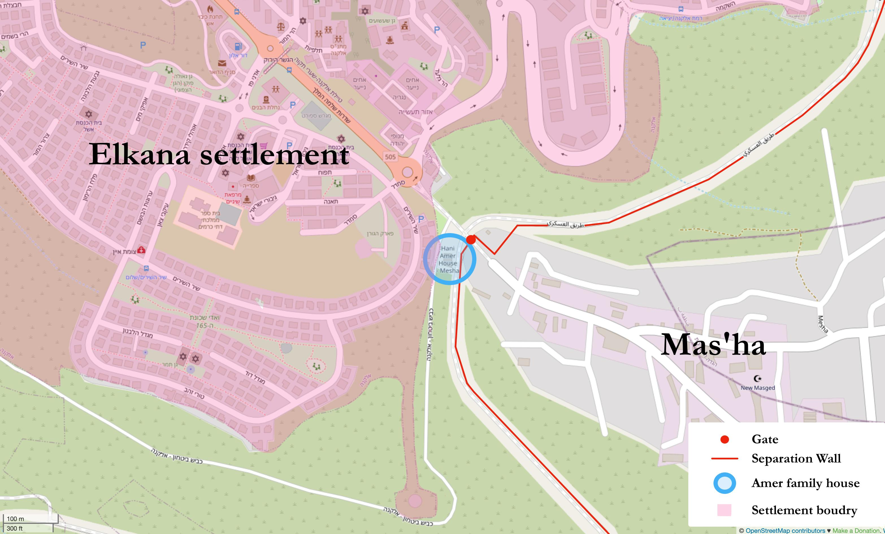
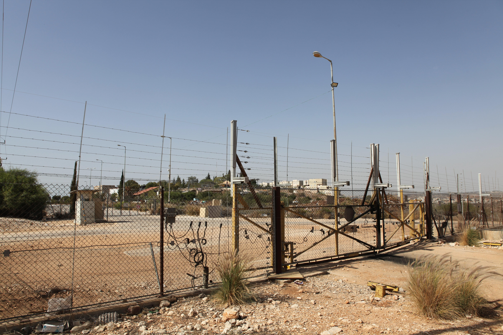

## 5.1 The Architecture of Eroding Bodily Mobility, Identity and Agency

The colonial world is a world cut in two. The dividing line, the frontiers are shown by barracks and police stations. In the colonies it is the policeman and the soldier who are the official, instituted go-betweens, the spokesmen of the settler and his rule of oppression. … It is obvious here that the agents of government speak the language of pure force. The intermediary does not lighten the oppression, nor seek to hide the domination; he shows them up and puts them into practice with the clear conscience of an upholder of the peace; yet he is the bringer of violence into the home and into the mind of the native [@fanon1963, 29].

This section examines how the omnipresence of khaki-clad soldiers and militarised structures in the landscapes of the West Bank and East Jerusalem functions to control Palestinians. Israel deploys both physical barriers and the transformation of natural features into instruments of control to restrict movement and visibility. As discussed in Chapter Three, a central aim of settler-colonialism is to dominate the colonised through spatial and temporal confinement, ultimately rendering them invisible to the settler gaze. This strategy also facilitates displacement, making room for further colonisation. Beyond restricting movement, these tactics work to sever ties between Palestinians and their land, erasing traces of villages and destroying symbols of resistance and identity.

### 5.1.1 Power over space and body: slow erasure around checkpoints

> If violence is done against those who are unreal, then, from the perspective of violence, it fails to injure or negate those lives since those lives are already negated. But they have a strange way of remaining animated and so must be negated again (and again) — Judith Butler [@butler2004a, 33]

In my research journal, I documented the everyday experience of going from Jerusalem to Ramallah, focusing on how movement is shaped by surveillance and military presence. The following journal entry captures one such journey, revealing the layered tensions and spatial politics at play.

> Departing from the bus station just a street away from Damascus Gate, the crowded bus journey from Jerusalem to Ramallah traced a path through East Jerusalem, making its way to the Qalandia checkpoint. Along this route, the bus would skirt sections of the towering concrete wall, an installation by Israel, seemingly cutting through neighbourhoods with no apparent plan. Rewind to 2014, and this very bus could directly reach the checkpoint with minimal interference, except for the singling out of Palestinians who, unlike Israeli or foreign citizens, had to disembark to have their ID cards[^id] checked. Those who did so stood shoulder to shoulder, steeling themselves for the inevitable inspection by Israeli military personnel. Onboard the bus, an uncomfortable atmosphere prevailed. Palestinians with Israeli citizenship and non-Palestinians who stayed on were scrutinised by soldiers in bulletproof vests armed with large guns.
> Meanwhile, other Palestinians were ordered to line up outside the bus for identity checks. Unsurprisingly, these procedures had become so normalised that soldiers no longer needed to ask for IDs. Fast forward to 2019, when the buses no longer ventured to Jerusalem, passengers were forced to switch buses. I joined my fellow travellers in this routine, disembarking, collecting our belongings, and proceeding through a gated fence. We followed a path to a covered area, a stark enclosure of metal fences and turnstiles. Standing alongside Palestinians, I patiently waited to pass through the single operational turnstile. Despite the checkpoint’s relatively low activity at this later time of the day, reaching the other side took a significant amount of time. There, Israeli soldiers demanded my passport and the small Israeli visa I had received upon arrival and going through customs. Palestinians were required to present their ID cards issued by Israel to those living in the West Bank and East Jerusalem without Israeli citizenship.
The modernised checkpoint facilities resemble modern airport security setups, with electronic ID checks and automated face-recognition scans before gates open while Israeli soldiers monitor the flow of people from behind glass windows. Palestinians are compelled to pass through these spaces within their own land, as if they were prisoners moving between cell blocks.
(research journal, May 2018)

In recent years, checkpoints like Qalandia and Bethlehem have undergone significant militarised architectural changes (for an example, see Figure 1 of how the checkpoint of Al-Shuhada Street in Hebron changed over time), turning them into labyrinthine structures that Palestinians must navigate to cross from areas like East Jerusalem into the West Bank. Changes included, for instance, the installation of remote-controlled automatic guns (see Figure 2) in Hebron. These remote-controlled guns can shoot sponge-tipped bullets, tear gas, and stun grenades at Palestinians. The compartmentalisation I described in Chapter Three encompasses a comprehensive system of military checkpoints, barricades, roadblocks, tunnels, observation towers, gates, fences with sensors, barriers, and the infamous wall.

*Figure 1. Timeline of the militarised architecture of the checkpoint of Al-Shuhada Street in Hebron. Illustration credit: Hebron Apartheid Project.*

*Figure 2. Installation of a new remote-controlled weapons system at the Al-Shuhada Street checkpoint in Hebron. Other surveillance cameras are also visible. Photo credit: Youth Against Settlements / Issa Amro*

To me, this forms one structural aspect of what Fanon meant when he wrote that the “colonial world is a world divided into compartments” [@fanon1963, 29]. In the mid-1980s, Edward Said wrote that Palestinian life is dispersed, inconsistent, characterised by the artificial arrangements imposed on interrupted or confined space, the dispersal of disturbed time and the unsynchronised rhythm:

The stability of geography and the continuity of land – these have completely disappeared from my life and the life of all Palestinians. If we are not stopped at borders, or herded into new camps, or denied reentry and residence, or barred from travel from one place to another, more of our land is taken, our lives are interfered with arbitrarily, our voices are prevented from reaching each other, our identity is confined to frightened little islands in an inhospitable environment of superior military force sanitized by the clinical jargon of pure administration [@said1985, 19-20].

The checkpoints and obstacles that rewrite the movement of Palestinian bodies are protected by a vast militarised complex and represent the biopolitical management of life (biopower) as a technology of control (see Chapter Three). The biopower exerted by Israeli soldiers over Palestinians is prominently evident at checkpoints but extends beyond these locations throughout Palestine through the involvement of, for instance, private security forces and settlers, as my friend’s ordeal on the way to Nablus illustrates.

In another entry from my research journal, I recorded an incident that highlights the everyday vulnerability of Palestinians to militarised surveillance and arbitrary detention.

I attended the “Women Between Patriarchy and Colonialism: Women’s Experiences in a Colonial Context” conference at An-Najah National University in Nablus, a friend kindly offered me a ride when he had to drive from Ramallah to Haifa for his business trip. Since Nablus is along the way, I took the opportunity. However, upon my return to Ramallah later that afternoon, I discovered that I couldn’t reach my friend by phone. Concerned and without information about his whereabouts, I began asking for any news. Unfortunately, nobody had been able to get in touch with him. It was well past midnight when my friend finally arrived in Ramallah and shared his ordeal with me. On the way to Nablus, he had passed by the entrance of a settlement and was stopped by private militarised security guards who took him to the checkpoint. Like many Palestinians, my friend had previously been incarcerated in an Israeli jail for his involvement in resisting settler colonisation during the First Intifada. Therefore, an alert was triggered when the private security guard checked his name in the Israeli computer system.
Consequently, he was detained for nine gruelling hours in a small office, where he was denied access to water or any other beverage. According to my friend, the detention of Palestinians for several hours, just like his experience, is a daily occurrence. It has sadly become so commonplace that it no longer garners much attention. It has become a part of everyday life for Palestinians.
Due to the proximity to the weaponised power of the sovereign, Palestinians often find themselves at the mercy of the sovereign powers embodied by the Israeli soldiers, private security, police, and settlers alike. The vulnerability is deeply connected to the architecture erected to slow down or completely halt bodily movement of Palestinians across the land. This exposes Palestinians to several forms of violence and to death. Through the recent installations of remote-controlled guns at checkpoints, there has been a move from human biopower to technological biopower.
(research journal, April 2019).

This incident, like countless others, reveals how the architecture of occupation not only disciplines Palestinians but also renders their suffering routine and unremarkable. The blurring of roles between state forces, private security, and settlers illustrates a diffuse and pervasive regime of control that extends far beyond formal checkpoints. This underscores how Palestinian life is continuously shaped by technologies of surveillance and detention that work to erode autonomy, dignity, and safety. What emerges is not a system of exceptional violence, but one embedded in the mundane, a slow, grinding machinery of control that enacts settler-colonial domination through both human and non-human instruments of power.

### 5.1.2 Along the wall

In a 2016 entry in my research journal from a visit to the village of Mas’ha, I documented the Amer family’s struggle to remain in their home, trapped between Israel’s Wall and a nearby settlement, an embodiment of how settler-colonial infrastructure reshapes life and land in the West Bank. The encounter with the absurdity of the architecture I describe below brings forth a focused form of slow violence that aims to gradually erase the presence of the inhabitants over time. I use the word “focus” here to emphasise how the slow violence is explicitly directed towards the physical presence of the Amers on their land, within their home. The years of slow violence reveal the deliberate and extended efforts behind this gradual erasure, highlighting the patience of the settler-colonial project in its relentless pursuit to displace Palestinians from their land. In other words, the violence inflicted in this situation is not only prolonged over time but also mirrors the protracted temporal attitudes of the settler-colonial project, which seeks to erase Palestinians from their land slowly.

> The bus transported us to the village of Mas’ha in the Salfit district of the West Bank. After a short walk of 50 meters, we reached what appeared to be the end of the street. Adjacent to the imposing concrete wall, which Israel illegally erected and cuts through the farmlands and villages in the West Bank, stood a large gate. On the other side of the fence, Hani Amer emerged and unlocked a small yellow gate, about two meters high, positioned next to the massive Wall (see Figure 3). This gate, to which Hani holds the key, was installed after a long battle, as it became the sole means of accessing the house. The entire network of fences, adorned with barbed and razor wire, along with the wall itself, is dotted with cameras and sensors that alert the Israeli military to any visitors to the Amer family.[^fig4-5]
> We proceeded to Hani and Munira’s house, situated in a cramped space squeezed between the wall and a military road on one side and barbed wire fences and the Israeli settlement of Elkana on the other side. Over a cup of tea, Hani and Munira shared with us the story of how life under occupation had profoundly affected them and their family. Originally from Kafr Qasim in the west, the Amer family was uprooted from their ancestral lands during the Nakba and eventually settled in Mas’ha. Israel confiscated the land adjacent to the house Hani had built in the 1970s and initiated the construction of the settlement. In 2003, Israel began building the Wall, intending for it to pass through their house. Hani and Munira faced a difficult choice between the demolition of his home and relocating to the other side of the wall or remaining in the house under the constant threat of Israeli oppression and severe hardships. Opting to stay, the Israeli bulldozers arrived and destroyed the greenhouses and garden surrounding the house. The Amers lost two-thirds of the land surrounding their house and an additional 20 dunams[^dunam] of agricultural land.
(research journal, September 2016).

*Figure 3. Hani Amer at the gate to this family house, between the wall and the settlement. Picture by author.*

*Figure 4. The location of the house of the Amer family. Source © OpenStreetMap contributors (CC BY-SA 2.0) under the Open Database License (ODbL). Legend, names and indicators by author.*

Their steadfast determination to remain in their home led to frequent attacks by settlers, including stone-throwing and constant harassment, resulting in broken windows and destroyed solar heating panels. Hani and Munira recounted the harrowing experience of regular night raids by armed soldiers, which had traumatised their youngest son and contributed to his aggressive behaviour at school. At one point, their three-year-old child managed to slip under the barbed wire fence and enter the settlement. Israeli soldiers refused to return the child, leaving the Amers in fear of a potential kidnapping. Thankfully, Palestinians working in the settlement were able to bring the child back home during the night. The soldiers placed the blame on Hani for the incident, causing him to question the humanity of Israeli soldiers. Hani further explained that there is always someone present at the house since the Israeli military passes by every day, shouting to check for occupants. He emphasised that if no one were home, the Israelis would undoubtedly occupy or demolish the house. As Hani shared his account of a life filled with resistance, a military vehicle arrived near the house, likely to monitor the situation, possibly triggered by the presence of myself and my comrades.
(research journal, September 2016).

*Figure 5. The fenced-off zone between the settlement (visible in the background) and the road to Mas’ha. The Amer family’s home is located within this small strip. Picture by author.*

The Amer family resides in an area surrounded by a militarised architecture enforced by both the Israeli military and the adjacent settlement. This militarisation gradually encroached upon the Palestinian town and brought with it embedded military violence, which manifested as a form of slow violence. The slow process of erasing the Amer family from their locality was presented as a choice. This absurd and illegal architecture, under international law, intensifies the focused slow violence directed towards the inhabitants of the house, aiming to gradually erase their presence over time. The years of slow violence expose the prolonged efforts employed to slowly erase the presence of Palestinians, revealing the patience exhibited by the settler-colonial project. In other words, the violence inflicted in this situation unfolds over an extended period, aligning with the prolonged erasure of Palestinians from their land, a characteristic of the settler-colonial project’s temporal attitudes. Through a friend I learned that Hani Amer died in May 2021.

The dispossession of land in the West Bank is frequently linked to the establishment, proximity, or expansion of settlements. These settlements are invariably accompanied by the military’s presence and the creation of a military zone. For farmland, this process entails the forceful destruction of buildings and crops and the uprooting of trees, often executed with harassment [see, for example, @hammad2020a]. The destruction of farmland not only disrupts people’s way of life but also symbolises the uprooting of Palestinians from their ancestral land. The destruction of olive trees, for example, signifies the displacement of Palestinians, who have a profound connection to the land.

House demolitions happen all too often in Palestine. In East Jerusalem, the forced evictions and demolitions of Palestinian homes, followed by the replacement of Jewish settlers, have been ongoing since Israel occupied Jerusalem in 1967. Palestinians initially fled the violence of Israeli troops during the Naksa, which refers to the displacement that occurred in the aftermath of the 1967 war. In 1954, an agreement between the United Nations Relief and Works Agency (UNWRA) and the Jordanian government led to the construction of a housing complex in the area. However, Israeli settler organisations have since sought to reclaim properties in the neighbourhood, claiming they belonged to Jewish families before 1948. This has resulted in legal battles favouring Israeli settlers and the subsequent forced evictions of Palestinian families. Sheikh Jarrah, where these evictions occur, holds significant cultural and historical importance for Palestinian society [@abusneineh2021; @alsaafin2021; @forensicarchitecture2021].

The impact of these evictions on Palestinian families is profound. Evictions often occur abruptly, leaving families without shelter and with limited recourse. Many families are left homeless, relying on community support or aid organisations for basic needs. The ongoing displacement and dispossession of Palestinians in Sheikh Jarrah is part of a broader pattern that has persisted since the establishment of Israel in 1948 (see Chapter Three). This displacement not only severs social and cultural ties but also contributes to collective trauma and loss. The fear of repeated displacement over the years has added to the collective trauma experienced by families and entire communities. The erasure caused by settler-colonialism extends beyond the living and their physical spaces. The resting places of the deceased, whether within the territories of 1948, East Jerusalem, or the West Bank, have also become targets of erasure due to the presence of Palestinians buried there and the historical significance they represent. For instance, the Ma’mam Allah (Mamilla) Cemetery, located near the Old City of Jerusalem and dating back to the Byzantine era, has suffered from Israeli development projects since 1948 [@khalidi2009; @pharoun2023]. Portions of the cemetery have been converted into parking lots, coffee houses, playgrounds, a school, and, ironically, even the “Museum of Tolerance,” all contributing to the erasure of history, identity, and the Palestinian connection to the land.

In the paragraphs above, I highlight the various tactics employed within the settler-colonial project to erase Palestinians from their spaces, directly aiming at erasing the Palestinian identity and agency. These tactics include physical separation through enclosures, militarised checkpoints, and disruption of mobility. Erasure occurs not only through the destruction of homes but also through the uprooting of burial sites, further eroding the identity and history represented by the deceased. However, these ongoing erasure efforts also strengthen Palestinian identity and resistance. It is important to note that identity is not an abstract concept; people are not passive entities in constructing identities. People are active agents shaped by their social context and locality. Identities are formed through interactions with others, with bodies serving as vessels for these interactions. By displacing Palestinians from their locality, settler-colonialism aims to disrupt the way future generations experience their identity, potentially leading to the gradual erasure of their connection to their land. Within the concept of slow erasure, the deliberate attacks on identity, agency, and episteme within the settler-colonial project aim to slowly erase the cultural and land ties.

---

## References

[^id]: Israel issues several types of ID cards to Palestinians in order to restrict their movement in all territories. Depending on the type of card, mobility is restricted. For instance, Palestinians from the West Bank cannot cross checkpoints into 48 and East Jerusalem without special permit. Palestinians living in Gaza are also forbidden to cross into 48 without permit. The ID card system complicates the movement of Palestinians, not only when it comes to crossing between territories, but also in receiving passports and traveling between national borders to, for instance, Egypt and Jordan. Israel can also use the system to ‘deport’ Palestinians from East Jerusalem to the West Bank.
[^fig4-5]: See Figures 4 and 5.
[^dunam]: One dunam دونم equals one decare or 1,000 square metres.