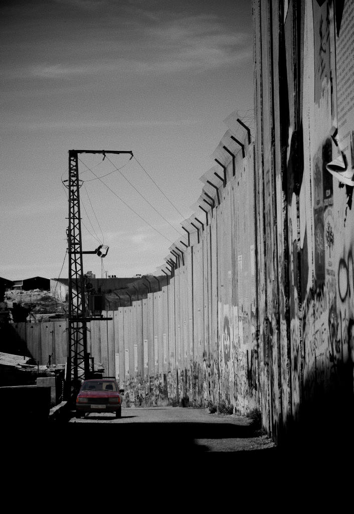

# 5. The Struggle Against Slow Erasure: A Journey of Perseverance

As I described in Chapter Two, both Fatah and Hamas, who govern the West Bank and Gaza respectively, are responsible for human rights violations against the Palestinian population. These actions, including arrests, beatings, torture, and even assassinations, are politically motivated. According to a report by Human Rights Watch [@humanrightswatch2018], both the Fatah-dominated Palestinian Authority in the West Bank and Hamas in Gaza have carried out numerous arbitrary arrests, primarily targeting supporters of the opposing party. This said, the focus of this chapter is Israel as the sovereign power in a settler-colonial context. This is not to suggest that Hamas and the Palestinian Authority’s violence is more justified, but rather to emphasise that understanding their violence requires considering the larger context of the occupation. As explained in Chapter Three, the power exerted over Palestinians by the Palestinian Authority and Hamas differs from the settler-colonial sovereignty. The underlying objective of the Zionist settler-colonial project is the ongoing establishment of a Jewish ethnostate, where the Indigenous are subjected to the violence of Israeli nationalism. Settler-colonialism operates by establishing dominance and control over the Other in a system that seeks to replace them. The purpose of this chapter is to demonstrate the ways in which Israel exercises control over Palestinians in various ways, some of which will be discussed in the following sections. 

This chapter explores how settler-colonialism attempts to erase Indigenous identity and agency and examines how this process shapes resistance. Acts such as land dispossession, destruction of crops and buildings, and restrictions on movement aim to undermine agency and identity. Additionally, attacks on the Indigenous episteme limit the ability of Indigenous peoples to make decisions about their own lives and communities, imposing settler norms and values. Understanding the consequences of these attacks on identity, agency, and episteme is crucial to understanding the long-term goals of the settler-colonial project. It also sheds light on the resistance efforts of the Indigenous population, which strive to preserve their cultures and assert sovereignty. Slow erasure, as experienced within settler-colonial projects, inflicts cumulative harm on Indigenous peoples and their land. The fact that slow erasure is slow-moving and takes place in different geographical spaces makes it necessary to look at different aspects of the settler-colonial project.

By critically examining the perpetuation and maintenance of settler-colonialism, I will provide an analysis in the following chapters that highlights the comprehensive nature of slow erasure. Furthermore, by viewing this analysis through the lens of slow erasure, I reveal the objectives of settler-colonialism and provide deeper insight into the resistance strategies and decolonisation efforts aimed at countering the complete erasure of the Palestinians. In this chapter, I trace instances of spatial and temporal slow violence that Palestinians experience. Through this exploration and the presented data, I reveal a consistent pattern in which settler-colonial power systematically undermines Indigenous identity, agency, and knowledge systems, even in events that may appear unrelated.

In the upcoming sections, I will examine how Palestinian bodies are constrained in their movement through architectural obstacles and the militarisation of space and time. I will discuss how slow erasure is exerted in relation to the territorial objectives of the settler-colonial project, which governs the spatiality of Palestinian bodies. Additionally, I will explore the link between forced relocation and the erasure of identity and episteme as a manifestation of slow erasure. Furthermore, the chapter will delve into the types of violence that result in bodily harm and death, as well as efforts to suppress grieving the bodies of martyrs.

---

## References