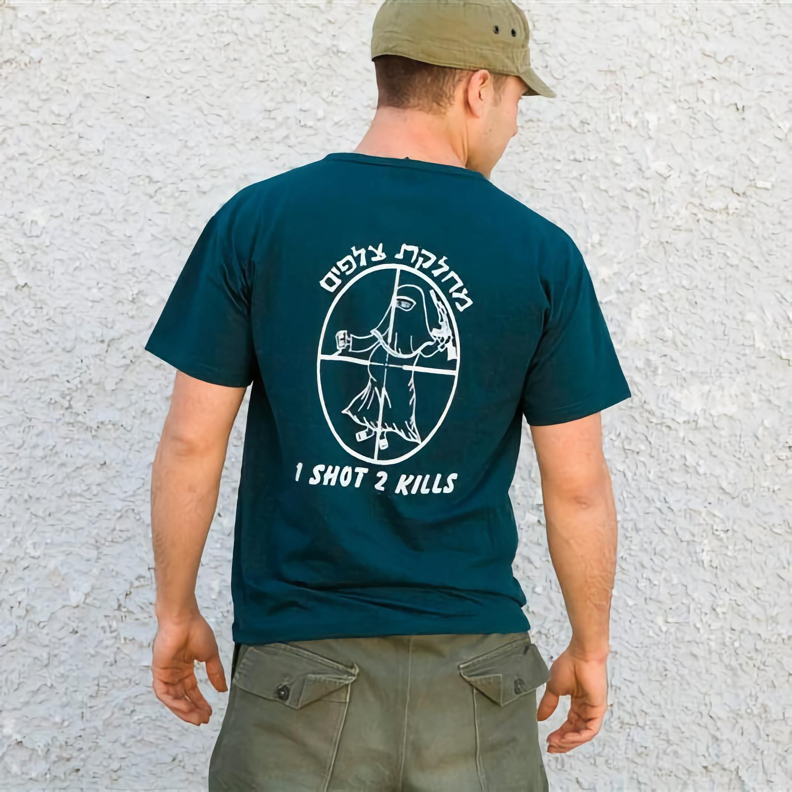
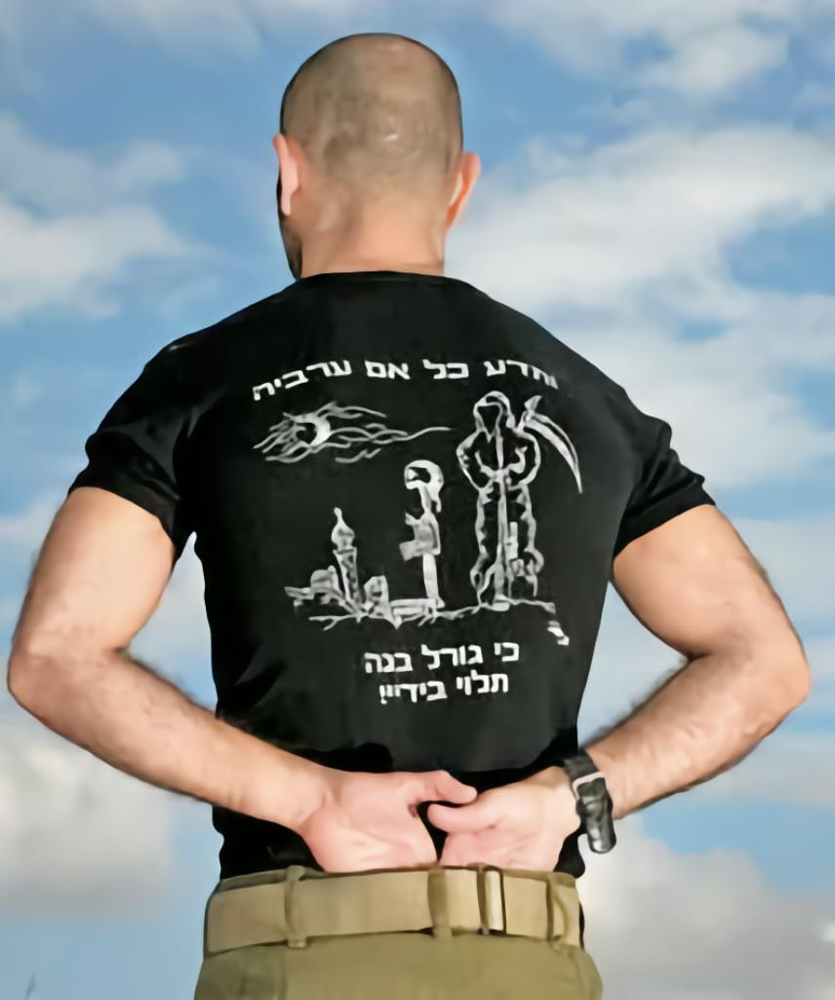
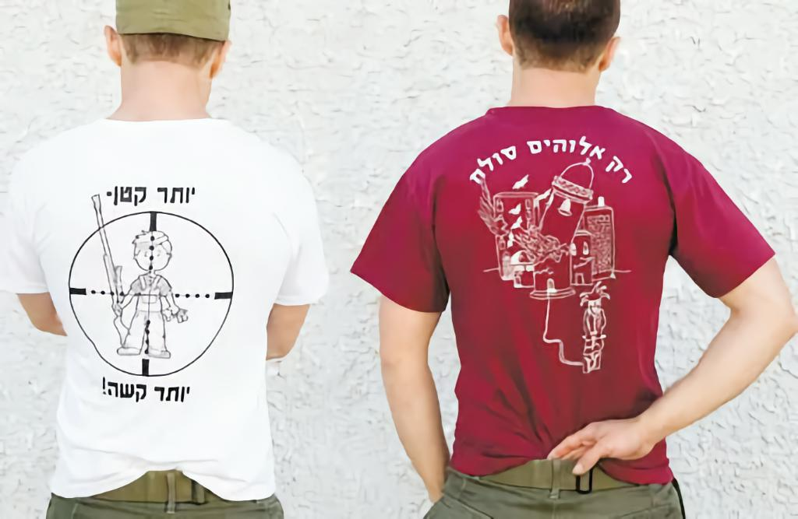
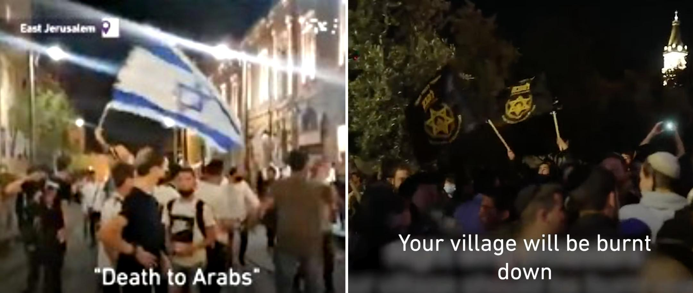
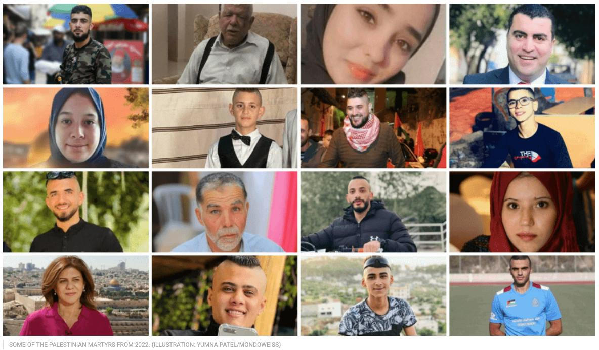

## 6.2 On Death

> “What place is given to life, death, and the human body (in particular the wounded or slain body)? How are they inscribed in the order of power?” – [@mbembe2003, 12].

### 6.2.1 The gendered body and reproductive necropolitics

If the disabling of Palestinians serves to limit resistance and erode agency in life, the management of death ensures that even in dying, Palestinians remain under the grip of colonial control. Killing is not simply an act of elimination but part of a sustained process of dehumanisation, where the dead body itself can become a site of political struggle. The withholding of corpses, the denial of medical aid to the injured, and the restriction of funerals aim to strip both individuals and communities of their ability to grieve, remember, and resist through collective mourning.

These necropolitical practices are not merely about physical death but about the slow erasure of Palestinian presence, denying the dead their dignity and the living their right to memorialise. In this way, the colonial sovereign does not simply dictate who lives and who dies but extends its power beyond the moment of death, weaponising grief itself. The following section explores how this unfolds, revealing the deep entanglement between death, control, and the broader machinery of settler-colonialism.

Nadera Shalhoub-Kevorkian [@shalhoub-kevorkian2015] explains that since 1967, Israel has implemented policies aimed at reducing the Palestinian population through forced population transfer. These policies have included revoking the residency status of at least 14,200 Palestinians, denying building permits, demolishing Palestinian homes, and withholding birth certificates from Palestinian newborns. Palestinian women and their unborn or newborn children are particularly vulnerable to these policies, as they are perceived as foreigners or invaders in their own land and viewed as a demographically undesirable population responsible for reproducing future generations of Palestinians. Within this demographic logic, Palestinian women, especially those who are pregnant or giving birth, are not only targeted as biological reproducers of the nation, but also subjected to gender-specific forms of settler-colonial violence. The establishment of checkpoints and barriers by Israel has severe consequences, particularly on Palestinian healthcare. The average travel time to reach healthcare centres increased drastically from around 10 minutes to over four hours [@unhchr2006].

The establishment of checkpoints and barriers, for example, has a particularly lethal effect on women seeking urgent reproductive care. According to the Information Health Centre of the Palestinian Ministry of Health, between 2000 and 2006, there were 69 cases of pregnant Palestinian women giving birth at Israeli checkpoints [@unhchr2006]. The denial and lack of urgent care at these checkpoints resulted in the tragic deaths of 35 newborn babies and five mothers during or after childbirth [@unhchr2006]. Checkpoints thus become necropolitical sites of reproductive governance, where the capacity to bear life is surveilled, obstructed, and sometimes violently ended.

Shalhoub-Kevorkian’s significant work on the surveillance and restriction of women’s pregnant and birthing bodies highlights the crucial role of checkpoints in creating what she describes as a “social geography of horror” [@shalhoub-kevorkian2015, 1195]. She details how this environment is characterised by “violence against the birthing journey” that intrudes upon “women’s spaces, time, bodies, and psyches through militarised control of their legal status, movement, and ability to reach medical facilities and care” [@shalhoub-kevorkian2015, 1202]. Through this lens, reproductive violence is not a peripheral effect of occupation, but a core method through which the settler-colonial state enacts demographic control.

The report also documents six cases of pregnant women being injured as a result of beatings, shootings, and the use of toxic gas by Israeli soldiers [@unhchr2006]. These incidents highlight the dire consequences and human suffering caused by the obstruction of healthcare access for Palestinians in need of passing checkpoints. In the context of settler-colonialism, similar to the systematic targeting of Native American women due to their reproductive capacity and the importance of ensuring the continuation of Indigenous peoples [@smith2003], Palestinian women are often portrayed as “hyperfertile, premodern, and irresponsible breeders” [@vertommen2017, 210]. These depictions of Palestinian women as merely biological entities stems from the patriarchal and hierarchical aspects of the Zionist nationalist project, which thrives on militarisation. The implementation of settler-colonialism by Israel is characterised by biopolitical violence [@zureik2011] through the framework of necropolitics, discussed in Chapter Four. This encompasses control over Indigenous populations’ body politics, demographics, and reproductive capabilities [@kanaaneh2002].

The perception of Palestinian women by the Israeli military is reflected in various ways, including the printing and proud display of t-shirts (Figure 6) by Israeli military units, which forcefully capture the systemic targeting of Palestinian women through necropolitical means.

*Figure 6. T-Shirt with the text “1 SHOT 2 KILLS” depicting a pregnant Palestinian woman in the crosshairs. Online image.[^figfound]*

The messages conveyed through these made-in-Israel t-shirts provide a clear example of how the Israeli soldiers perceive the Palestinian woman. In the mindset of the settler-colonial military, the Indigenous population has been dehumanised, and Palestinian women are portrayed as hyper-fertile, primitive breeders responsible for bearing the next generation. This depiction is a form of semiotic violence, expressing the underlying sentiments and attitudes towards Palestinian women. Other t-shirts worn by Israeli soldiers feature texts such as “Every Arab mother must know that the fate of her son is in my hands” (see Figure 7) and “The smaller, the tougher” (see Figure 8) accompanied by a drawing of a child in the crosshairs [@silverstein2009]. These t-shirts are indicative of what sociologist Orna Sasson-Levy explains as the radicalisation process taking place within Israeli society, with the soldiers at the forefront [@blau2009]. There exists a perception that Palestinians are not viewed as individuals entitled to basic human rights, allowing for any treatment to be inflicted upon them [@blau2009]. This dehumanisation of Palestinians, including the unborn and pregnant women, reveals the effects of political violence and the logic of elimination on women’s reproductive bodies within the framework of settler-colonial necropolitics [@wolfe2006; @shalhoub-kevorkian2009; @shalhoub-kevorkian2015]. Additionally, it exposes Islamophobia and Orientalism by depicting Palestinian women as terrorists (with a machine gun in hand) and religious fundamentalists (carrying the Quran).

*Figure 7. T-Shirt with the text “Every Arab mother must know that the fate of her son is in my hands”. Online image.[^figfound]*

*Figure 8. T-Shirt with the text “The smaller, the tougher” on the left and “Only God forgives” on the right. Online image.[^figfound]*

These depictions of Palestinian women as hyperfertile threats and primitive reproducers are not isolated or merely symbolic; they are embedded within a larger ideological and institutional framework that normalises militarised violence against Palestinians at all levels of society. The same settler-colonial logic that targets the reproductive capacities of Palestinian women also cultivates a broader culture of militarism, one in which the IOF is valorised, violence is naturalised, and Palestinians are cast as existential threats to be eradicated.

### 6.2.2 Necropolitical control at the moment of death

The process of militarisation, which is deeply rooted in the Zionist settler-colonial fabric, whether at an individual or societal level, leads to the normalisation of the perceived need for the military and militaristic assumptions [@enloe2000]. It is then not surprising that parallel attitudes can be drawn between the settler-military, in this case, the “most moral army in the world” [@almayadeen2024], as Israeli leaders like to call the IOF.

The images below (see Figure 9) illustrate rallies held by far-right Israeli Zionists, often settlers, which are not uncommon, particularly in and around Jerusalem. These gatherings, protected by the police, feature chants of “death to Arabs” and “Your village will burn down.” Such calls for violence against Arabs can be heard during protests, especially in the vicinity of Jerusalem’s old city, particularly around May 14, known as Flag Day, when Israel celebrates its establishment. The use of the word “Arabs” in this context serves as a denial of the Palestinian identity. The demand for the elimination of Palestinian villages serves as a stark reminder of settler-colonialism’s objective to eradicate the Palestinian people from their ancestral lands, as exemplified by the Nakba.

*Figure 9. Far-right Israeli activists chant “death to Arabs” and “Your village will burn down” in East Jerusalem[^videofound]*

Given the prevailing mindset among the military presence in the West Bank and East Jerusalem, it is not surprising that lethal force is frequently employed against Palestinians. In the first four months of 2023, over 90 Palestinians were killed in the West Bank and East Jerusalem, while 13 Israelis were killed in the same territory [@unocha2023]. However, even more concerning than instances where a Palestinian is killed upon impact of the projectiles is the deliberate denial of triage, a form of initial medical care, which becomes weaponised. While there is much to explore regarding the weaponisation of care, this chapter will primarily focus on the process of slow erasure. The concept of weaponisation of care will come back in the subsequent chapter, but it is important to set the tone by acknowledging documented incidents of shootings and other acts of bodily harm where Palestinians were left to bleed to death or were denied proper medical attention. The NGO Euro-Med Human Rights Monitor documented some of these killings in which first care was refused or delayed, and the injured Palestinian was left to bleed out:

> On November 25, Mohammed Ismail Al-Shobaki, 20, attempted to stab an Israeli soldier near the entrance to Al-Fawwar camp in southern Hebron, then was shot and left bleeding on the ground. Euro-Med Monitor has access to a videotape showing  the availability of Israeli ambulances in the area, but while Israeli medical staff provided immediate help to the injured Israeli soldier, the calls of help of from Al-Shobaky went unanswered until he died.
>
> Mahmoud Talal Nazzal, 17, was shot in the head and neck by Israeli soldiers on October 31. Nazzal was accused of attempting to stab a soldier at the Jalma checkpoint in northern Jenin. He was left bleeding for about 105 minutes without any emergency treatment by the MDA[^mda] medical staff present in the area. Instead, Israeli soldiers dragged his body into the checkpoint and stripped him of his clothes. Only after he was confirmed as dead was his corpse handed over to the Palestinian Red Crescent.
>
> On October 25, Dania Irshid, 17, was shot by Israeli soldiers near the Sanctuary of Abraham, even though she had been checked twice for weapons. She bled for about 45 minutes before she finally died on the ground while an MDA ambulance stood by. Palestinian ambulances were prevented from providing the necessary medical treatment.
On October 12, Ahmed Saleh Manasra, 13, was beaten with batons and pipes by Israeli citizens and policemen. Then, an Israeli car ran him over, causing many broken bones. As documented on a videotape verified by the Euro-Med team, Manasra continued to bleed for at least an hour without receiving any medical help from a nearby MDA ambulance. He later was transferred to Hadassah Medical Center in Jerusalem, where he has been charged with trying to kill a 13-year-old Jewish boy.
Israeli soldiers opened fire at Hadeel Al-Hashmalon, 18, on September 22, after she allegedly was seen with a knife in Hebron. Palestinian medical personnel were prevented from aiding the girl. When an Israeli medical team arrived, she had lain bleeding for 40 minutes. She died hours later as a result.
>
> [@euro-med2015]

The Palestinians in the cases described above, most of them teenagers, are subjected not only to lethal violence but to a form of death management, where their suffering is prolonged, and medical care is selectively withheld, making it weaponised. The fact that Israeli medical teams were present but refused to administer aid to the wounded Palestinians while tending to Israeli soldiers illustrates how Zionist necropolitical power operates: life is contingent not only on one’s actions but also one’s identity. In Mahmoud Talal Nazzal’s case, his body was dragged, stripped, and withheld before being handed over to the Palestinian Red Crescent. Such treatment serves to deny him both personhood and dignity, reducing his body to an object of state control even after death. The act of stripping is particularly significant; it symbolises both physical exposure and symbolic erasure, a deliberate humiliation that extends beyond death. This practice can be compared to other colonial contexts where Indigenous dead bodies are rendered inert, deprived of their social meaning, and turned into instruments of state messaging, both to instil fear and to reinforce the perceived supremacy of the dominant group, see also [@deleon2015]. This illustrates how necropolitical power operates through selective abandonment, ritualised violence, and the stripping of both bodily integrity. The refusal of aid, prolonged suffering, and the criminalisation of death all serve to reinforce the perception of Palestinians as killable bodies whose deaths require neither justification nor mourning. These practices are not isolated but constitute a broader structure of systematic erasure, wherein the Palestinian body is forcibly unmade through the withholding of dignity in both life and death.

Shalhoub-Kevorkian [@shalhoub-kervorkian2019] writes that the colonial view of injured and dead bodies sees colonised flesh as, at best, a necessary evil and, at worst, deserving of amputation and injury. She analyses how the treatment of Palestinian bodies as disposable, coupled with the sociopolitical violence faced by the internally displaced, the present absentee, the unrecognised person, and the refugee, reveals the deep impact of ongoing and unacknowledged uprooting, dispossession, and displacement [@shalhoub-kervorkian2019, 113].

When Israel kills Palestinians, they actively transform the identity of the dead body. When Palestinian lives are effectively destroyed, there is a deliberate transformation of their identity. Israeli media, politicians, and military spokespersons immediately label the slain individuals as terrorists [@chagankerian2013; see also @oliveira2025; @shotter2025]. This perception plays a role in determining triage priorities, as highlighted by Deputy Minister of the Interior Yaron Mazuz’s statement: “The priority should be given to the residents of Israel, mostly to those who were injured from the attacks. Is it unacceptable that we would treat terrorists before residents of the state” [@cohen2016]. Here, the prolongation of the dying process, as seen in recorded incidents, can last up to 45 minutes, revealing that the goal is not just to cause death but to inflict suffering on the body before it dies [@patel2022]. The consequences of the ultimate death of the individual on the family and community will be discussed later. Every living person carries unique knowledge embedded in its culture, traditions, and practices. 

Erasure seeks to eliminate this embodied knowledge possessed by the targeted individual. With time and life, the person would have had the ability to pass on significant knowledge to future generations, such as how to navigate life under settler-colonial rule. This knowledge is lost, sometimes in an instant and other times over the course of 45 minutes.

### 6.2.3 The afterlife of the dead body: grief, martyrdom, and interference

The settler-colonial sovereign employs various methods to curb the mourning of martyrs. One of these practices involves keeping the bodies of killed Palestinians hostage even after they have lost their lives, thereby affecting their identity and agency even in death. When someone we know, whether a family member, friend, or colleague, passes away, we mourn and grieve. The rituals surrounding death include how we handle the deceased body. In Palestine, funerals are conducted in accordance with the religion of the deceased and their family. These rituals often involve washing the body and allowing people to pay their respects to the deceased and offer condolences to the family. The act of mourning together can serve as a healing process and can also foster a sense of political community, as Butler [@butler2004a] suggests. However, the loss of life through acts of violence adds an additional layer of grief for those left behind.

When a person dies, it is customary for humans to commemorate the life it lived. Funerals are held, and a mourning process unfolds. When a Palestinian body is killed by Israelis, it is simultaneously attributed the identity of a martyr during commemoration. This identification is not necessarily because the living body actively resisted oppression but rather because the person was killed by its oppressor. Within the commemoration of the deceased body, the narratives employed serve to “explain the past and frame the present and the future” [@khalili2007a, 91]. 

Funerals for Palestinian who died at the hands of the occupier, as described by Lori A. Allen [@allen2006], become stages where participants and observers engage in public political debates. One important agency of resistance described by Laleh Khalili [@khalili2007a] is that of sumud, meaning steadfastness or steadfast perseverance. I will delve further into sumud when discussing forms of resistance later in this chapter. For now, it is important to recognise that the killed individual, through its newfound identity as a martyr, possesses agency in reinforcing steadfastness and resistance (which is, needless to say, not necessarily active or armed). Naturally, the occupying sovereign does not passively accept this transformation of identity and agency bestowed upon the martyred by their community.

*Figure 10. Some of the Palestinians killed by Israel in 2022, given the identity of martyr. Picture by Yumna Patel/Mondoweis.*

According to the Jerusalem Legal Aid and Human Rights Center [@jerusalemlegalaidandhumanrightscenter2020], Israel has refused to return over 250 dead Palestinian bodies to their families between October 2015 and June 2020. As of May 2020, the number of bodies withheld by Israel is 62 Palestinians, not including those buried in Israeli-controlled cemeteries over the past decades [@jerusalemlegalaidandhumanrightscenter2020]. Israel began burying Palestinian bodies in unmarked mass graves, known as maqaber al-arqam or number tombs, in the late 1960s [@wahbe2020]. 

Since 2015, Israel has kept dead bodies in refrigerated morgues instead of allowing proper burial [@daher-nashif2021]. Israel imposes conditions on the return of bodies to their families, such as requiring monetary guarantees and limiting the number of attendees at the funeral. They also demand that funerals take place at night or dawn and prohibit the expression of any political slogans [@jerusalemlegalaidandhumanrightscenter2020]. Families are forbidden from conducting autopsies, and the bodies must be buried within two hours [@jerusalemlegalaidandhumanrightscenter2020].

The strict demands placed on Palestinian families before the return of a dead body for burial can be understood through Butler’s concept of grievability. Butler recognises the political significance of public grieving, which has the potential to evoke outrage in response to the injustice of death or the unbearable loss [@butler2009a]. Regimes of power heavily control affective responses such as these and can be heavily censored as well [@butler2009a]. Shalhoub-Kevorkian further explains that “the colonizer, life passes not only through the capacity to kill the Other in order to live but also through the capacity to control the death of the Other, even after they are dead” [@shalhoub-kervorkian2014]. The dead body becomes a weapon of slow violence by becoming a hostage in the grief of those who were connected to the body during its life. As long as the possibility exists that the body of a loved one lies in a numbered grave or freezer, the family remains trapped in additional prolonged torment.

In an interview with Zena Al Tahhan, Mohammed Nassar, the father of Shadi Nassar, who is still awaiting the return of his son’s body when I write this, describes the experience as psychological torture, filled with doubts about whether his son is truly dead or still alive. The anguish and uncertainty of the families denied the ability to bury their loved ones can persist for years, extending the necropolitical violence beyond the moment of life and death:

> We’re always nervous … even though it’s been 15 years … Sometimes, we get doubts about whether he’s really dead, because we haven’t buried him ourselves … It’s been extremely difficult for us. Only God knows how we’ve managed to get through these years … This is a form of psychological torture. Every day is a painful day. We keep getting ideas that he may still be alive. [@altahhan2017]

By withholding the dead bodies, Israel engages in the necropolitical management of death, dictating the conditions under which Palestinian families can initiate their mourning process, which typically begins with the burial of their loved ones. This practice of denying burial becomes an emotional punishment that affects both the processes of bereavement and mourning, constituting a form of slow violence [@daher-nashif2021]. Due to the affective power of denying the return of the dead bodies, the forced delay in the mourning process becomes a collective punishment, inflicting slow violence on a larger scale, effectively denying the agency to mourn the martyr in customary ways.

### 6.2.4 Slow violence and the disruption of mourning

The settler coloniser, perceiving Palestinian lives as lesser bodies over which they can decide whether they live or die, not only considers the dead Palestinian body as ungrievable but also prevents others from grieving the martyred person. When the physical body is present and can be mourned, the living bodies can bid farewell to the deceased, wash and prepare the body for burial, and seek solace in the collective act of mourning. The inability to perform burial rites and engage in social interaction with other mourners from the family and community introduces stress factors that can impact the well-being of those left behind. This effectively comes down to denying the mourners the agency of dealing with the loss in customary ways. When the family and community are unable to process and acknowledge their grief due to the absence of a funeral, it obstructs cultural heritage, traditions surrounding funeral rites, and the commemoration of the deceased. It also prevents emotions from resonating through the social fabric, as emotions are intertwined with the social and personal realms, as discussed in Chapter Three.

By keeping the dead bodies hostage and imposing rules and restrictions on the funeral process, the sovereign power seeks to disarm the identity and agency embodied by the deceased. The practice of withholding the dead bodies constitutes a form of slow erasure, denying the commemoration and remembrance of the lives lost. The dead body is desired rather than abjected, as Suhad Daher-Nashif explains, expanding the necropolitical practices beyond existing Western theories on death [@daher-nashif2021]. Moreover, the inability to grieve the physical body can lead to emotional numbness and detachment. This denial of the mourning process and the communal expression of grief inflicts further harm on the individuals left behind, exacerbating the collective trauma experienced by the community. In summary, the settler-colonial sovereign employs strategies such as withholding dead bodies, imposing restrictions on funerals, and controlling the mourning process to undermine the new identity bestowed upon the deceased by their community. By keeping the bodies hostage, the sovereign engages in necropolitical practices that extend beyond the moment of death, inflicting slow violence on the bodies, families, and communities involved, aiming at the erasure of their agency in the mourning process.

---

## References

[^figfound]: Image found on Richard Silverstein’s blog at https://www.richardsilverstein.com/2009/03/20/idf-t-shirts-boast-of-killing-babies-pregnant-women-sodomizing-hamas-leaders. Origin unknown.
[^videofound]: Stills from video by Middle East Eye taken in April 2021: “Hundreds of far-right Israeli activists took to the streets of Jerusalem’s Old City on Thursday night chanting ‘death to Arabs’ and ‘Arabs get out.’” [https://youtu.be/PUe8XmmaJxI](https://youtu.be/PUe8XmmaJxI)
[^mda]: The Israeli organization Magen David Adom (MDA) is the Israeli is Israel’s national emergency medical, disaster, ambulance and blood bank service. It is the equivalent of the Red Cross and Red Crescent and is officially recognised by the International Committee of the Red Cross (ICRC).
