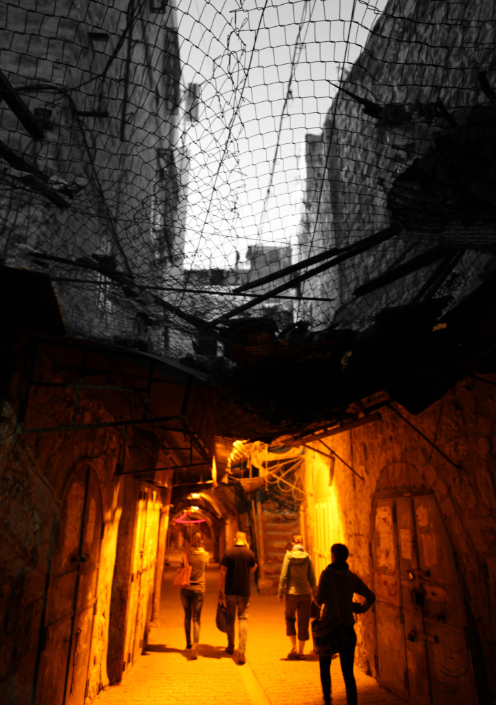

# 6. If not to Disable, then to Kill

In contrast to Chapter Five, which examined settler-colonialism through spatial dispossession, forced relocation, and attacks on Indigenous epistemes, this chapter turns to the Palestinian body, whether disabled, maimed, or killed, as a central site through which Israeli colonial power is enacted. While the previous chapter focused on how land, architecture, and temporality are weaponised to erode Palestinian identity, agency, and episteme, here I focus on how the body itself becomes a terrain of control, contestation, and elimination.

This chapter is structured in two main parts. The first explores the intentional maiming of Palestinians through targeted shootings, denial of medical care, and the militarised fragmentation of daily life. These acts are not incidental but function as a mode of governance, producing disability as a condition of dependency and disempowerment. The wounding of the body becomes a strategic intervention that limits mobility, shatters political and social participation, and fragments collective resistance.

The second part shifts to the management of death and its aftermath. Here, I analyse how the Israeli state withholds corpses, restricts funerals, and criminalises mourning, transforming the dead body into a political object and grief into a site of sovereign intervention. These necropolitical practices extend violence beyond life, denying both the dignity of the dead and the agency of the living to mourn, remember, or resist.

Gendered and reproductive bodies, particularly those of Palestinian women, are also targeted through distinct forms of violence. From the denial of care during pregnancy to the portrayal of women as hyperfertile threats, these practices reflect a deeper demographic logic: one that aims not only to kill but to prevent the reproduction of Palestinian life altogether. In this sense, the settler-colonial project enacts violence across the full spectrum of bodily existence, living, birthing, dying, and grieving.

Rather than viewing these practices in isolation, I examine them as part of a broader continuum of slow erasure, where violence is dispersed across time and space to wear down life, possibility, and memory. The goal of this chapter is not only to document harm but to analyse how bodily control, through maiming, death, and the obstruction of mourning, functions as a mechanism of settler-colonial power aimed at the systematic suppression and unmaking of Palestinian presence.
