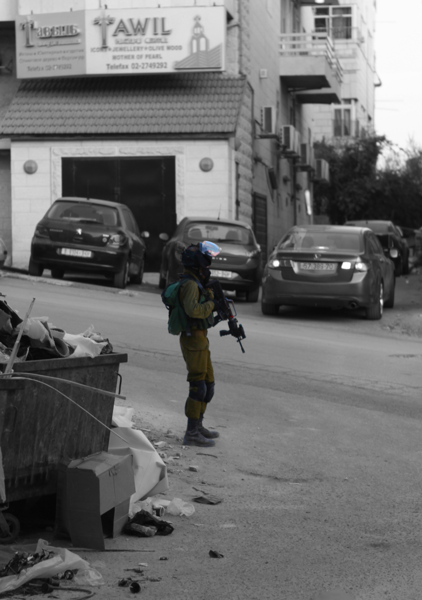

# 7. Palestinians in the Microcosm of Captivity

>“You do not feel like a human being in that place. We were treated like animals.” Amina, 15 years old [@savethechildren2020]

In this chapter, I examine the politics of the Indigenous body from the moment of captivity[^detention] to its confinement within compounds, where it disappears from public view into spaces of interrogation and torture. In these settings, Palestinians are subjected to prolonged torture, sometimes for months, by their captors, who seek to break their resistance and gradually erase Palestinian identity and agency. As people rely on others for their physical and mental well-being, the deliberate denial of care, what I term the weaponisation of care, is a common tactic in the microcosm of torture and imprisonment. This strategy serves the broader aims of settler-colonialism, reinforcing the erasure of identity and agency.
The question ‘What constitutes torture?’ warrants consideration before proceeding, as violence takes many forms that may be classified as torture. In this chapter, I use the term in the context of the settler-colonial reality in which Palestinians live, where violence is employed as a tool of control and necropolitics determines who lives and who dies. The UN Convention Against Torture defines torture as the intentional infliction of severe physical or mental pain by or with the consent of a public official, often for purposes of punishment, coercion, or discrimination [@unga1984].

However, though this chapter also has its focus on torture, its main argument is that the reasons behind the torture used by Israel on Palestinians are not merely aimed at gaining information through what David Sussman [@sussman2005] referred to as interrogational torture. Sarah Maddison writes that one aspect of the structural violence implemented by the settler-colonial regime concerns “the regulation of Indigenous identity” [@maddison2013, 289]. This regulatory power shapes not only how Palestinians are governed but how they are defined, and punished, for resisting. Within the framework of slow erasure, I argue that Israel tortures in order not just to regulate but also to erase Indigenous identity and break any agency of resistance to both the torture and the general erasure Palestinians face. Indeed, as this chapter argues, one of the reasons behind the torture regime implemented by Israel is indeed deeply rooted within the settler-colonial policies that attack Palestinian identity and agency, with the aim to erase not only any form of resistance against the Zionist project but also erase the Palestinian identity itself.

Our relationship with the world around us is always experienced through the body, and under torture, the body becomes wholly subjected. Physical pain is not the only form of torment inflicted, though sustained torture often begins by breaking the body. As the following sections will illustrate, within the realm of torture, anything can be weaponised to inflict suffering on the tortured body, what Elaine Scarry [@scarry1985] describes as an agent of pain.

As Four Three explains, slow erasure aims to dismantle Indigenous identity, agency, and episteme, not only the broader capacity to act, but also the capacity to resist. Embodied resistance often places the Indigenous under greater scrutiny and threat, especially when settler-colonial regimes seek to punish any form of defiance. Torture becomes one of the most direct ways the state attempts to break this resistance: by inflicting pain so severe it severs the individual’s connection to the world and to others. Dennis D. Waskul and Pamela van der Riet [@waskul2002] describe this as an “abject embodiment,” where the individual is reduced to suffering.

In describing torture, I am conscious of the risks of unintentionally reinforcing the torturer’s power. Language that renders the tortured subject passive or voiceless replicates the very aims of torture itself: to silence, erase, and dominate. My intention is not to portray those who have endured torture as broken or defeated, but to foreground their resistance (which I will discuss more in Chapter Eight), even when expressed in fragmented or quiet ways.

---

## References

[^detention]: Since 1967, an estimated 800,000 Palestinian men, women, and children have been subjected to detention. Notably, children as young as 12 years old are vulnerable to prosecution in military courts. Each year, approximately 500 to 1,000 children find themselves detained, with the most common accusation being stone-throwing. Disturbingly, over half of these detained children experience arrest during the night, and many report enduring both physical and psychological abuse throughout their arrest, transfer, and interrogation process. The military court system demonstrates a high conviction rate, with 95% of cases resulting in a guilty verdict. Furthermore, around 50% of Palestinian child detainees are held in prisons located in Israel, a practice that contravenes Article 76 of the Fourth Geneva Convention. This situation highlights significant human rights concerns and underscores the need for urgent attention to the plight of these young detainees. Under Israeli military law, army commanders wield comprehensive executive, legislative, and judicial authority over approximately 3 million Palestinians residing in the West Bank, with the Palestinian population having no influence over how this authority is exercised. The Israeli military authorities in the West Bank continue to base the prosecution of Palestinian civilians, including children, on the Fourth Geneva Convention, which paradoxically also prohibits the construction of settlements. While international law permits military courts to prosecute civilians, it is intended only as a temporary measure. However, the Israeli military courts for Palestinians in the West Bank have been operational since 1967. (Military Court Watch, 2019).
