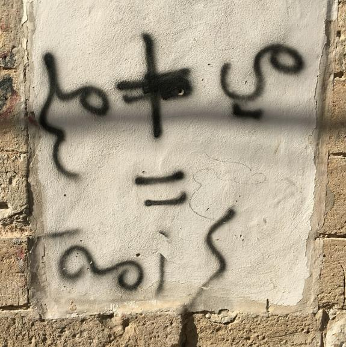

## 8.2 Resistance in Prison

Palestinians in Israeli prisons have employed various tactics to secure better treatment during their incarceration. Acts of resistance, such as refusing to work and smuggling mobile phones, sperm (see further down this chapter), books, letters, and other materials, are common. Protests, non-compliance, hunger strikes, and boycotts often accompany these efforts.

As I explained in the previous chapter, Israel uses a variety of torture techniques during interrogation. My friend Shazain, whom we met in the previous chapter, provided a vivid account of resistance during his interrogation. It captures the psychological battle between the interrogator and Shazain, as the person being interrogated. It highlights how maintaining defiance and composure in the face of violence can be a potent form of resistance. It illustrates the use of sumud as a tool to undermine the interrogator’s:

> What used to piss them off is that when they go in and interrogate you again, and they see that you are still strong and you don’t care about them and you are pissing off the investigator, and of course, the more you piss off the interrogator, the more violence he is going to use. What I learnt in my life is that the more violence he uses only indicates that he [the interrogator/torturer] is pissed off and is not able to take the information from you, and when your body adjusts to the beatings, it means that you are defeating him and not the opposite. One time, the interrogator asked me about something, and I said: “I swear to God I don’t know what you are talking about”. He answered me back by saying, “Leave God on the side”. Then he asked me again, and I said: “I swear to God I don’t know”. So, what he did is that he got a pack of matches, opened it and said: “We put God here.” and he closed it, so he asked me again, and I said: “I swear on the life of Mohammad I don’t know.”. So he said: “We will put Mohammad here.” and he closed it again and then he looked at me and he was asking me about a guy and what my relationship with this guy was, so I told him “I swear to God I don’t know.”, so he said “No, we agreed that we put God and Mohammad in the matchbox.”, so I told him “When you opened it to put Mohammad in, God went out.”. He immediately kicked me and told them [the guards] to take me away. I pissed him off. (Interview with Shazain, 14 May 2019)

The use of humour, as Majken Jul Sørensen writes, is a powerful nonviolent tactic in resistance against oppression, employed to turn “oppression upside down” [@sorensen2008, 180]. Within the use of humour in resistance, Sørensen observes three processes unfolding at the same time: First, the humour employed is confrontational, aiming to provoke, mock, or ridicule, thereby intensifying the conflict and exerting pressure on the oppressor. Second, while heightened pressure increases the likelihood of repression, paradoxically, the use of humour diminishes fear within the resistance movement. And third, humour limits the oppressor’s ability to respond in a manner that can later be justified. (ibid.).

The passage from my interview with Shazain highlights the dynamics of the use of humour in resistance in the context of the interrogation. The more the interrogator becomes frustrated and resorts to violence, the more it indicates that they are failing to break the spirit and resistance of the one being tortured. Shazain used wit and clever responses, even in the face of violence, which is a form of psychological resistance. Sørensen argues that while the oppressor may retaliate with violence in response to the use of humour, this reaction becomes more difficult to justify [@sorensen2008]. But honestly, when has Israel ever felt the need to justify its violence?

By not giving in and continuing to frustrate the interrogator, Shazain seemed to gain a sense of victory, as was visible by the grin on his face while telling me the story. The anecdote about the matchbox underscores the use of humour and quick thinking as tactics to maintain one’s dignity and resist the dehumanising attempts of the interrogator. Ultimately, the passage suggests that resistance is not just about enduring physical pain but also about maintaining one’s mental fortitude and the ability to undermine the oppressor’s power through cleverness and psychological resilience. Furthermore, the resistance offered to the interrogation vividly illustrates how agency and identity are maintained in a context of extreme power imbalance. Shazain exercised agency by choosing how to respond to the interrogator’s violence and coercion. This act of defiance is a powerful expression of agency, as it shows the ability to maintain autonomy and influence the dynamic of the interaction, even in such dire circumstances.

In terms of identity, the story reveals how the individual reaffirms their sense of self and beliefs in the face of efforts to strip them of their dignity and humanity. By invoking religious figures and cleverly subverting the interrogator’s attempts to mock those beliefs, Shazain reinforced his identity and refused to let the interrogator define or diminish it. Resisting through mental resilience and clever responses becomes a way of preserving and asserting one’s identity, showing that even in the most oppressive conditions, individuals can find ways to express who they are and what they stand for. This interplay between agency and identity highlights the profound strength of sumud in maintaining selfhood and autonomy in the face of dehumanisation.

The Palestinian prisoner movement has traditionally seen its role as one of challenging prison authorities and transforming Israeli colonial prisons into centres of revolution, spaces of resistance, and hubs of education for Palestinian prisoners. According to Lena Meari et al. (2022), captivity, therefore, becomes a battleground for confronting the strategies of the colonisers rather than a mere violation of rights to be contested through legal channels, as human rights-based perspectives might suggest. Palestinian prisoners, as Sofie Oliver (2010) writes, embody and demystify human dignity and develop new ways to resist the logic of dehumanisation.

One of the Palestinian children kept in an Israeli prison was Ahed Tamimi. In her book about her experiences facing Israeli violence, she recounts her time in the Israeli Hasharon prison for women. In one passage, Tamimi describes playing a prank on the security guard as she made her rounds to conduct a headcount in the cells:

> One evening, out of boredom, we started coloring on our faces using the colored pencils given to us by representatives from the Red Cross. Makeup isn’t allowed in prison, but glamorizing ourselves (or at least trying to) was one way for us to reclaim parts of our lost teenagehood. We used the black pencil as eyeliner and dipped the red one in water to apply as lipstick. As we were busy getting dolled up, Hadiya said, “Let’s play a prank on the guard!” A huge prankster myself, I immediately signed on to the idea, knowing we had to strike a tricky balance. We wanted to pull off a little prank that would scare the guard and entertain us, but that wouldn’t be too bold and land us in solitary. So what did we do? I instructed all the girls to go wild drawing on their own faces with the colored pencils. We dipped them in water and outlined our lips in black and drew on giant raccoon eyes. We also drew on whiskers, to try to look as crazy and terrifying as possible. Sure, we’d spend the next four hours scrubbing our faces to get it all off, but the prank would be worth it. We then grabbed every article of clothing we could find and draped them over our heads. I told one of the girls to heat up some water, and once it had boiled, we poured it into a pot and placed it on the floor, in the middle of the cell. One of the girls sat hunched over the pot, which now had steam rising from it, and started chanting nonsensical gibberish while flailing her arms to bring the steam closer to her insanely colored face. The rest of us slowly walked around her while chanting in the deepest octave we could hit, Hummm daa dee, hummm daa dee, and pounding on our chests. As we chanted, the girl in front of the pot covered her head with a blanket and bent over the steam to inhale it. She did this repeatedly as we chanted and marched around her, pounding our chests. While we were immersed in our fake séance, the guard came by for the head count as usual. A look of horror came over her face at the sight of us seemingly summoning spirits. She was so scared, she left immediately. It was the first time she didn’t count us. When she walked away, we broke out in laughter. It felt like a victory. The prank was satisfying not just because it was hilarious, but because it felt like a small act of resistance. We had once again showed a guard that our spirits would not be broken by this prison. Quite the contrary—we faked summoning spirits just to turn the tables for an instant and make her the uncomfortable one for once. [@tamimi2022, 194-5]

The act of Ahed and her fellow child prisoners dressing up with makeshift makeup, orchestrating a prank, and performing a mock séance to scare the guard is a manifestation of their sumud. Despite being imprisoned and deprived of their freedom and youth, the girls found a way to reclaim a sense of control, agency, and humour. This playful resistance is a subtle yet powerful expression of their unbroken spirits and refusal to let the prison environment strip them of their humanity and their young minds’ imagination. By turning the tables and making the guard uncomfortable, even if just for a moment, they asserted their resilience and the fact that their spirit remained undefeated. In this prison setting, humour can be more than a coping mechanism, it is a strategic act of agency and resistance. Humour, as Arthur Berger writes, “has a language of its own” (2020, vii). Indeed, the prank described in the passage relied on non-verbal cues, exaggeration, and performance, all elements of a comedic “language” that conveys resistance, solidarity, and defiance without the need for direct confrontation.

The prank provided a momentary escape from the bleakness of prison life. By immersing themselves in a self-created, playful world, the girls carved out a temporary space where they are in control. Their humour actively challenged the authority of the guard. I interpret this not simply as temporarily forgetting their conditions but as forcing someone in power to feel momentarily out of place and uncomfortable. Through absurdity, play, and laughter, the girls disrupted the structures designed to oppress them. Their prank did not physically change their reality, but it allowed them to assert control over their emotions, bodies, and social bonds. For a brief moment, they were not just prisoners; they were performers, pranksters, and agents of their own amusement. And in a space meant to break them, that small act of joy is a radical form of defiance.

### 8.2.1 Seeds of resistance: sperm smuggling 

Palestinian prisoners, designated as security detainees by the Israeli Prison Service, are systematically denied certain basic rights from the outset. For example, family visits are restricted to immediate relatives and are limited to just 45 minutes. Physical contact between spouses is forbidden, with prisoners and their visitors separated by a glass barrier. Only children under the age of eight are permitted brief physical contact with their fathers during these visits [@baker2011].

A couple of chapters ago, I wrote about when my friend got pulled over by private security guards after having dropped me off in Nablus, where I attended the “Women Between Patriarchy and Colonialism: Women’s Experiences in a Colonial Context” conference at An-Najah National University. During this conference, I heard about sperm smuggling for the first time.

The first documented case of a child born from sperm smuggled out of an Israeli prison is that of Muhannad al-Zaben, born to Dallal al-Zaben and Ammar al-Zaben in August 2012. Muhannad’s birth, with his father Ammar serving a life sentence in Hadarim prison, was seen as an act of resistance against the harsh realities of daily settler-colonial violence. Muhannad’s birth became a source of hope for the prisoner’s family, with the father choosing the name Muhannad from inside his prison in honour of his friend Muhannad Al-Taher, who was assassinated by occupation forces in Nablus in 2002 [@hamie2024]. Sperm smuggling and in vitro fertilisation (IVF) have evolved into both a socially acknowledged and legally sanctioned phenomenon. Sigrid Vertommen (2017) argues that for Palestinian prisoners, “every sperm is sacred” because it represents a subversive act of resistance, whether by physically producing children or symbolically by defying prison regulations and giving rise to new generations that embody hope and freedom for their families. According to Vertommen, the significance of sperm as a biopolitical act of resistance is linked to the Zionist project in Palestine. As Layal Ftouni [@ftouni2024]] points out, Israeli authorities attempt to crush sperm smuggling through various legal and political tools, such as deeming the children conceived in this way as illegal and illegitimate and denying them any identity documents that confirm their existence. The majority of these children are strictly forbidden from visiting their fathers, who are punished for sperm smuggling, including being taken into solitary confinement and denied family visits (ibid.).

Following what I wrote earlier in this work (see Chapter Six) on how the Israeli military happily dehumanises Palestinian children and pregnant women, the creation of new Palestinian life by smuggling sperm and IVF stands as an act of resistance to the aims of the settler-colonial attitudes towards Palestinian life in general. Indeed, the smuggling of sperm thwarts settler-colonial efforts “to curtail the reproduction of life and inaugurates a practice of life-making and a conception of life beyond its adjudication” [@ftouni2024, 94]. By circumventing the restrictions imposed by the prison, Palestinian prisoners and their families resist the control exerted over their bodies and lives, which I perceive as a symbolic victory over the system that seeks to dehumanise and disempower them.

Sperm smuggling is not a singular act but rather part of a deeply embodied and communal form of sumud. The body itself becomes a site of resistance, first through the prisoners’ act of extracting and securing their sperm under strict surveillance, and then through the extensive network required to ensure its preservation and delivery to their wives. Sperm must be quickly transferred to external medical professionals or trusted intermediaries before it loses viability, a task that requires precision, secrecy, and significant communal support. After the sperm is successfully smuggled, the process continues: the mother-to-be must undergo IVF.

Thus, sumud is present not just in the act of smuggling but in every stage that follows: in the prisoner's determination to defy his carceral conditions, in the care and courage of the intermediaries who transfer and preserve the sperm, in the women who carry the child after IVF, and in the broader networks of families and communities that support them throughout this process. These collective acts of care ensure that life persists despite a system designed to suppress and eliminate it.

The practice of sperm smuggling is not just about reproduction. It is a multifaceted act that touches on profound issues of identity, agency, and resistance. For Palestinians, it can be interpreted as a way to affirm their existence, assert their rights, and resist the structures of power that seek to control and diminish them. Through this act, prisoners and their families not only defy the physical and psychological constraints imposed by imprisonment but also contribute to the broader struggle for Palestinian self-determination and continuity. The act of smuggling sperm can be seen as a form of agency where prisoners and their partners exercise control over their reproductive rights. In a situation where their bodies are under the complete control of the prison authorities, smuggling sperm is a way for prisoners to take back some control over their lives and futures, exerting agency in an environment designed to strip them of it. It also empowers families of prisoners, especially the wives, to display agency by participating in this process. They actively engage in a process that defies the restrictions placed upon their husbands, thereby asserting their agency in the face of occupation and imprisonment.

The creation of new life while the Zionist project is trying to achieve the complete opposite, namely, the eradication of the Indigenous, is an act of resistance and an attempt at countering the necropolitics that the Zionist project imposes on Palestinian bodies and lives. This act of resistance is deeply tied to the affirmation of identity and agency, challenging the systematic efforts to erase Palestinian existence. By creating new life, prisoners and their families assert their identity and reclaim their agency in a context designed to strip them of both. Through sperm smuggling, they resist the necropolitical agenda that seeks to control and erase them, transforming an act of reproduction into a powerful assertion of their right to exist, to define their future, and to maintain their cultural and national identity against overwhelming odds.

### 8.2.2 The revolutionary university

The very persistence of Palestinian bodies within these architectures of control signals an enduring resistance that refuses to submit to invisibility. The continued transmission of knowledge, despite attempts to suppress it, defies the settler-colonial project’s claim to total erasure. Palestinian identity, episteme and agency, though under attack, remain animated through acts of resistance, whether in the insistence on remaining in one’s home, in the replanting of olive trees, in the storytelling of elders, or in the refusal to accept the imposed erasures of history. The slow erasure of settler-colonialism is met with a slow resistance, one that asserts presence against a structure built to erase it. The Indigenous body, despite its attempted subjugation, remains a site of knowledge, memory, and defiance. Palestinian identity endures, resisting erasure even in the most violent conditions of settler-colonial domination.

In his published experiences, Khaled al-Azraq (2009) writes he was first imprisoned in 1982 at the age of 16. Within the prison walls, he found something entirely unexpected: he discovered inside the prison what had eluded him outside it, namely an education. al-Azraq’s story illustrates how education within the context of imprisonment becomes both a tool of resistance and a means of empowerment. Despite the severe restrictions imposed by the Israeli prison system, Palestinian prisoners have transformed incarceration into an opportunity for intellectual and political development. The establishment of a clandestine library, the smuggling of books, and the organisation of structured learning environments demonstrate a refusal to succumb to the intended dehumanisation and isolation of imprisonment. Instead, education is actively cultivated as a means of self-liberation and collective resilience:

> In prison, and through a long and arduous struggle, the prisoners’ movement has been able to win and maintain the right to a library. Members of the prisoners’ movement came up with ingenious ways of smuggling books into Israeli prisons, methods that Israeli prison guards were never able to discover. The movement systematically organized workshops, seminars and courses held inside the prison to educate prisoners on every relevant topic one can imagine. Every day, the prisoner holding the position of “librarian” would pass through the different cells and sections, and prisoners would exchange the book they had just finished for the one they were about to begin. The librarian carried the “library book,” a record of the books available in the library, and a list of the books each prisoner had requested.
>
> Talking about this reminds me of one of the most memorable prison library moments. We had found out that the movement had managed to smuggle Ghassan Kanafani’s Men in the Sun into the old Nablus prison. We all raced to get our names on the list of people wanting to read the book, and the wait lasted weeks! Several times, we resorted to making copies of sought-after books like this. Of course, copies were done with pen and paper, and I remember copying Naji Aloush’s The Palestinian National Movement of which we made five hand-written copies. I remember how we all raced for the writings of Gabriel Garcia Marquez and Jorge Amado, Tolstoy and Dostoevsky, Hanna Mina, Nazim Hikmet, and many, many others.
>
> Through the will and perseverance of the prisoners, prison was transformed into a school, a veritable university offering education in literature, languages, politics, philosophy, history and more. The graduates of this university excelled in various fields. I still remember the words of Bader al-Qawasmah, one of my compatriots who I met in the old Nablus prison in 1984, who said to me, “before prison I was a porter who could neither read nor write. Now, after 14 years in prison, I write in Arabic, I teach Hebrew, and I translate from English.” I remember the words of Saleh Abu Tayi (a Palestinian refugee in Syria who was a political prisoner in Israeli jails for 17 years before being released in the prisoner exchange of 1985) who told me vivid stories of prisoners’ adventures smuggling books, pieces of paper and even the ink-housing tubes of pens.
>
> Prisoners passed on what they knew and had learned in an organized and systematic fashion. Simply put, learning and passing on knowledge and understanding, both about Palestine and in general, has been considered a patriotic duty necessary to ensure steadfastness and perseverance in the struggle to defend our rights against Zionism and colonialism. There is no doubt that the Palestinian political prisoners’ movement has played a leading role in developing Palestinian national education.
>
> [@al-azraq2009, 29]

The experiences of Khaled in Nafha prison present a very clear resistance against the efforts to deprive Palestinian prisoners of accessing knowledge. The prisoners’ efforts to create and maintain a library, despite the oppressive environment of an Israeli prison, represent a form of intellectual resistance and the maintenance and expansion of knowledge. The prison, as the previous chapter explains, typically a place intended to break the spirit and stifle the mind, was transformed into a space of learning and cultural preservation.

The determination to educate themselves and each other symbolises a collective resistance against the forces of Zionism and settler-colonialism, which aim to suppress and marginalise the cultural and historical narratives of the oppressed through slow erasure. In my view, this represents how the prisoners preserve their intellectual freedom by engaging with literature, philosophy, politics, and history and nurturing a collective memory and identity essential to the Palestinian struggle. Moreover, the prisoners’ movement’s commitment to education reflects a broader struggle against the slow erasure of Palestinian identity. The prisoners’ initiative to pass on knowledge, even when it required painstakingly hand-copying books, was a deliberate effort to resist the cultural and intellectual suppression that is a tool of settler-colonial domination. By educating themselves and others, they ensured that the knowledge of their people, their history, and their cause would not be lost, even in the face of severe repression.

In essence, Khaled underscores how education and the preservation of knowledge are acts of resistance, a point that resonates with my discussion in Chapter Five on the erasure of episteme, where the Palestinian curriculum itself becomes a contested site under settler-colonial rule. The prisoners, through their efforts to create a “university” within the walls of their prison, fought against the erasure of their culture and history, ensuring that their knowledge and identity would endure. This narrative illustrates sumud through the power of intellectual resistance in sustaining a struggle against oppression and the importance of knowledge as a tool for resilience and liberation.

Palestinian children in Israeli jails also find ways towards education, though not without a fight. Palestinian youth need to pass the tawjihi, the final exam of high school, which includes subjects such as Arabic, English, mathematics, physics, biology, chemistry, computer sciences, geology and civil studies, and is important as it allows entry to university studies. In her book, Ahed Tamimi writes about how the Israeli prison system tried to curb the education received while imprisoned.

Tamimi describes how there were nine women trying to complete our tawjihi year in prison, including her mother, who had never graduated from high school. With limited textbooks, they shared one book among nine women, copying its contents into our notebooks, when available. The Israeli prison authorities frequently obstructed their education, withholding supplies and interrupting classes by sounding alarms, forcing them into our cells. They accused the lessons of being a form of incitement and threatened the teacher with solitary confinement. Eventually, they shut down the classroom entirely. In response, the women launched a collective strike, refusing to leave their cells. The authorities relented, reopening the classroom but forbidding them to enter. They defied the guards, naming it “the classroom of defiance.” Though, as Ahed writes, the guards continued to spy on them and disrupt their studies, they persisted, because, for them, education was resistance. [@tamimi2022, 195-9]

This resistance against intellectual suppression highlights their refusal to let the prison authorities dictate what they can learn and know. The prisoners, including Ahed’s mother, who never graduated from high school, showed resilience by organising their classes, shared scarce resources, and developed strategies to overcome the prison authorities’ attempts to disrupt their learning. Their collective decision to leave their cells in protest of the classroom closure is an act of sumud, showcasing their refusal to surrender to the prison authorities’ arbitrary and cruel decisions. Their steadfastness was further emphasised by their persistence in studying despite constant surveillance and threats from the guards. I would argue that they are not passive victims of their circumstances but active participants in their lives, making strategic decisions to maintain their dignity and intellectual growth. Their ultimate defiance of the ban on the classroom and renaming it as “the classroom of defiance” further illustrate their agency in reclaiming a space for learning and resisting oppression.

The importance Palestinians give to education is also visible in Gaza, despite the ongoing Israeli fast-paced genocide, the relentless arbitrary and targeted bombings, the orchestrated mass shootings at US/Israeli food distribution points, and the mass starvation tactics. Nadera Mushtha recounts how students attended school for the last day on 5 October 2023:

> That day became a tragic dividing line between normalcy and chaos, between life and death ... students have witnessed scenes no one should ever see: death, bloodshed, and heartbreak. Despite all this, education remains a lifeline, a small piece of hope and normalcy amid the horror ... Despite the horror, we students of Gaza still hold our pens like weapons of truth. We write, we learn, we dream. Our schools may be reduced to rubble, but our will is stronger than any bomb. [@mushtha2025].

### 8.2.3 Weaponising the body: hunger strikes

As I wrote earlier in this work, Israel can hold Palestinians in administrative detention without being charged with a crime or presented with evidence, usually starting with an initial six months and renewed indefinitely. At the time of writing, Addameer reports 3405[^admindetention] Palestinians kept in such conditions. However, Palestinian aspirations for freedom have permeated the prison, turning it into a site of resistance where prisoners strive to disrupt the colonial power over their bodies. Hunger strikes, as an extreme and life-threatening form of struggle in Israeli colonial prisons, exemplify this disruption. Each individual or collective hunger strike challenges the colonial order both within and beyond the prison walls, affirming Palestinians’ unwavering pursuit of a liberated future. [@meari2022].

In 2016, while living in Birzeit, about seven and a half kilometres from Ramallah, I came across graffiti on a wall in the old town that read مي + ملح = كرامة (water + salt = dignity) (see Figure 12). Water and salt are the only things Palestinians ingest during total hunger strikes.

*Figure 12. مي + ملح = كرامة (water + salt = dignity)*

Hunger strikes represent a hard form of resistance for Israel to control. Hunger strikes serve as a non-violent form of resistance against oppression, injustice, or inhumane treatment. These actions can serve as ways to improve the conditions of Palestinian prisoners, such as improving the quality and quantity of food, access to books as described earlier in this chapter and increasing contact with family.

By refusing to eat, Palestinians in Israeli captivity transform their body into a space of resistance, or as Ashjan Ajour puts it, a space of “revolution” [@ajour2021]. In doing so, hunger-strikers transform their individual, corporeal suffering into a political act that connects their bodies to the collective Palestinian body, one marked by the necropolitics of settler-colonialism. This act of self-starvation not only asserts agency under extreme constraint but also reinforces the interconnectedness of personal resistance and national struggle. On a larger scale, the hunger-striking prisoners can be seen to keep the struggle for the liberation of Palestine alive. For many prisoners, particularly political ones, hunger strikes express their identity and solidarity with a broader cause. They are often seen as a way to reaffirm their commitment to their struggle or beliefs, even when faced with the harshest conditions inside captivity. Through their actions, hunger strikers destroy the Israeli technologies power it holds over the agency of its captives through “antagonistic appropriation of the Israeli paradigm of separation between bodies and minds” [@ajour2021].

> In order to be able to practice sumud in the interrogation, I considered death as a viable option. I imagined my death at numerous moments in the interrogation. This stiffened me and enabled my sumud. [Ahmad Qatamesh, a Palestinian-in-sumud, quoted in @meari2014a]

Hunger strikes have a deeply sacrificial logic [@shwaikh2023]. Within the settler-colonial necropolitics, the sovereign decides over life and death. By taking control over their own nutrient intake, the individual body or a collective of bodies who are engaging in hunger strikes take away the power from the sovereign by literally taking life back into their own hands. Within the settler-colonial necropolitical order, where sovereignty dictates life and death, hunger strikers disrupt this power dynamic by refusing to comply with the state’s control over their survival. However, hunger strikes are not merely individual acts of defiance; they are profoundly collective, uniting prisoners and the wider Palestinian body politic in an assertion of sumud. Palestinian hunger strikes are emblematic of a shared struggle, reinforcing a collective national identity and a refusal to submit to erasure. The act of coordinated starvation extends beyond personal endurance, it embodies the steadfastness of Palestinianhood itself, transforming the prison into a battleground where bodies reclaim agency against colonial domination.

The Israeli Prison Authorities (IPA) has responded by force-feeding the starving bodies through intubation. In an interview with Linah Alsaafin, Mousa Sheikh relates how he was force-fed when he was on hunger strike in the 70s:

> The prisoner enters the room handcuffed and legs shackled … There are two police officers on either side of the prisoner, who terrorise him physically and mentally. They poke him harshly in the ribs and on the back of the neck, talking the whole time in a way that is meant to break the prisoner’s spirit, saying things like ‘you are practically dead now.’ The prisoner is tied to a chair so that he can’t move. The doctor then sticks the tube up the nose of the prisoner in a very harsh way … When it was done to me, I felt my lungs close as the tube reached my stomach,” Sheikh recounted. I almost suffocated. They poured milk down the tube, which felt like fire to me. It was boiling. I could not stay still and danced from the pain. I danced a lot. [@alsaafin2015]

Force-feeding can equally lead to the death of the prisoner, as Mousa further explains that while the prisoners were all subjected to the painful procedure, his cellmate, Abd al-Qader Abu al-Fahm, was killed by the procedure due to internal bleeding [@alsaafin2015]. The method described by Mousa is a brutal one, used by the prison system to re-assert control over prisoners as a form of punishment and to suppress resistance. The technology of force-feeding reflects a broader strategy within the oppressive Israeli prison system, where power dynamics are enforced through physical and psychological coercion. It uses a combination of physical, psychological, and medical techniques aimed at regaining and maintaining power over the body of the Palestinian prisoner. It is designed to break down the individual’s resistance, assert dominance, and discourage dissent or protest within the Palestinian prison population.

---

## References

[^admindetention]: This statistic reflects the number of 11 March 2025. The number of Palestinians forced into administrative detention is ever-fluctuating. For the latest numbers, please visit https://www.addameer.ps/statistics. 