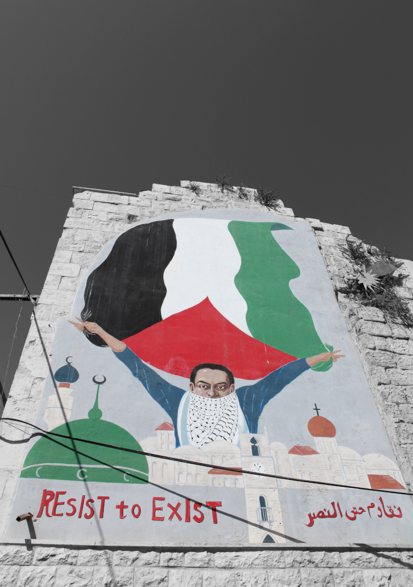

# 8. “Palestine will be Free” فلسطين ستتحرر

In the previous chapters, I have outlined both the methods Israel uses to target Palestinians in their daily lives and the gruesomeness of how Palestinians can be treated within prisons and torture rooms, all aimed at breaking resistance and destroying the agency and identity embodied within Palestinian existence. Israel uses a plethora of tactics in addition to the kidnapping and imprisonment of Palestinians, including daily harassment, violence, rape and murder at and around checkpoints, armed incursions into villages and the privacy of homes, the demolition of livelihoods and the punishment of every outing of Palestinian identity. 

I would like to end this work by putting a spotlight on how Palestinians resist the slow erasure I have covered in the last three chapters. Hence, this section will look at some of the different forms in which Palestinians subjected to settler-colonialism resist the slow erasure they face.

In the first section, I will look at how sumud is embodied by Palestinians in their daily lives, especially when confronted by the militarised aspects of the settler-colonial project. In the second section, I look at sumud from within the Israeli prison system by looking at embodying sumud while under interrogation and torture, making sure that life can blossom even from behind bars, how education within prison plays a pivotal role in Palestinian resistance, and how Palestinians pressure the Zionist system by the weaponisation of their bodies. 
