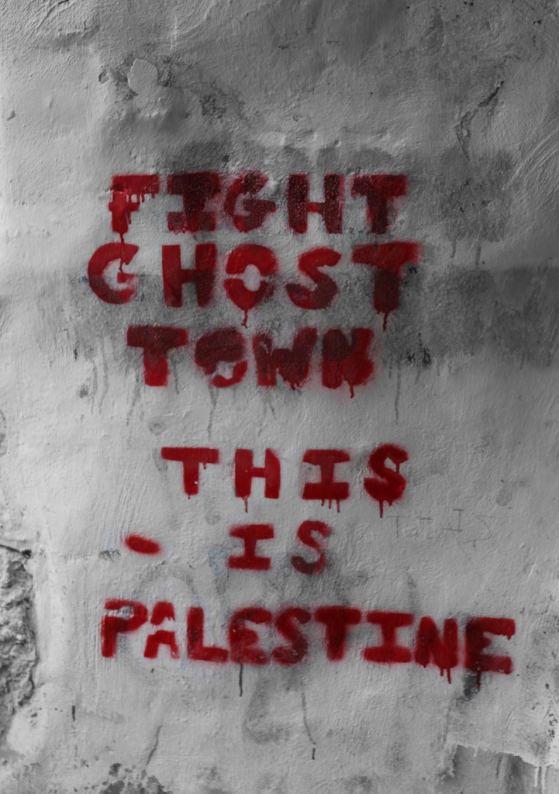

# 9. Conclusion: Slow Erasure

  <h1 id="darwish-title-ar" dir="rtl" lang="ar">علَى هَذِهِ الأَرْض مَا يَسْتَحِقُّ الحَياةْ</h1>

  

علَى هَذِهِ الأَرْض مَا يَسْتَحِقُّ الحَياةْ: تَرَدُّدُ إبريلَ, رَائِحَةُ الخُبْزِ فِي
الفجْرِ، آراءُ امْرأَةٍ فِي الرِّجالِ، كِتَابَاتُ أَسْخِيْلِيوس، أوَّلُ الحُبِّ، عشبٌ
عَلَى حجرٍ، أُمَّهاتٌ تَقِفْنَ عَلَى خَيْطِ نايٍ, وخوفُ الغُزَاةِ مِنَ الذِّكْرياتْ.
علَى هَذِهِ الأرْض ما يَسْتَحِقُّ الحَيَاةْ: نِهَايَةُ أَيلُولَ، سَيِّدَةٌ تترُكُ
الأَرْبَعِينِ بِكَامِلِ مشْمِشِهَا, ساعَةُ الشَّمْسِ فِي السَّجْنِ، غَيْمٌ يُقَلِّدُ سِرْباً مِنَ
الكَائِنَاتِ، هُتَافَاتُ شَعْبٍ لِمَنْ يَصْعَدُونَ إلى حَتْفِهِمْ بَاسِمينَ, وَخَوْفُ
الطُّغَاةِ مِنَ الأُغْنِيَاتْ.
علَى هَذِهِ الأرْضِ مَا يَسْتَحِقُّ الحَيَاةْ: عَلَى هَذِهِ الأرضِ سَيِّدَةُ
الأُرْضِ، أُمُّ البِدَايَاتِ أُمَّ النِّهَايَاتِ. كَانَتْ تُسَمَّى فِلِسْطِين. صَارَتْ تُسَمَّى
فلسْطِين. سَيِّدَتي: أَستحِقُّ، لأنَّكِ سيِّدَتِي، أَسْتَحِقُّ الحَيَاةْ.
  

  محمود درويش

  

  <h2 id="darwish-title-en" lang="en">On This Earth</h2>

  

We have on this earth what makes life worth living: April’s hesitation, the
aroma of bread
at dawn, a woman’s point of view about men, the works of Aeschylus, the
beginning
of love, grass on a stone, mothers living on a flute’s sigh and the invaders' fear
of memories.
We have on this earth what makes life worth living: the final days of
September, a woman
keeping her apricots ripe after forty, the hour of sunlight in prison, a cloud
reflecting a swarm
of creatures, the peoples’ applause for those who face death with a smile,
a tyrant’s fear of songs.
We have on this earth what makes life worth living: on this earth, the Lady
of Earth,
mother of all beginnings and ends. She was called Palestine. Her name
later became 
Palestine. My Lady, because you are my Lady, I deserve life.
  

  Mahmoud Darwish

